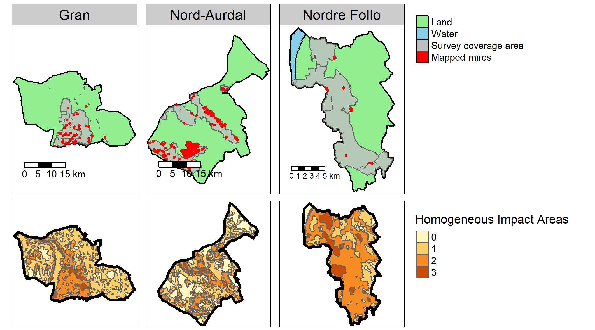
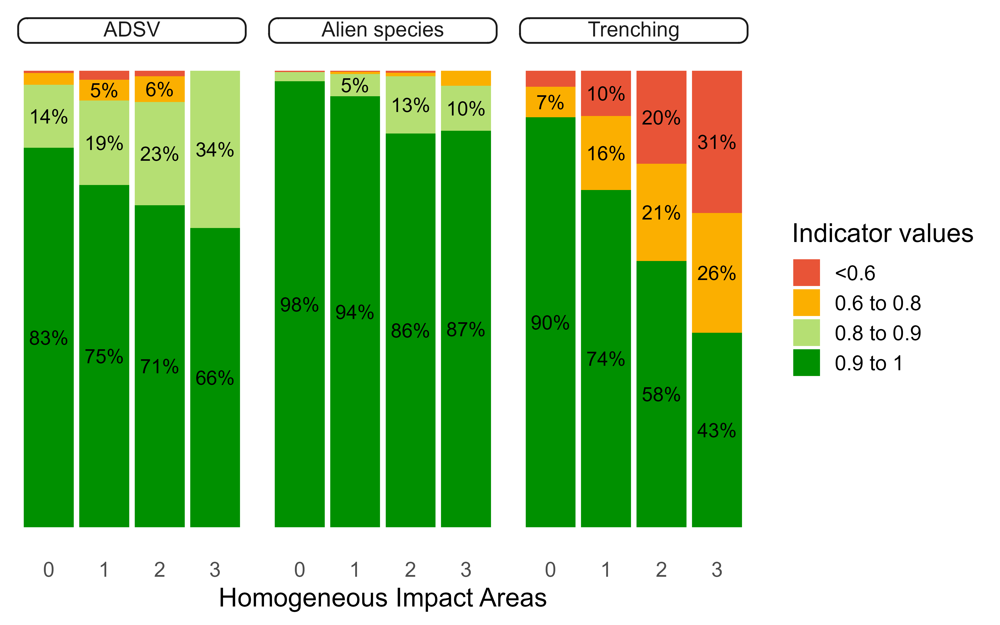
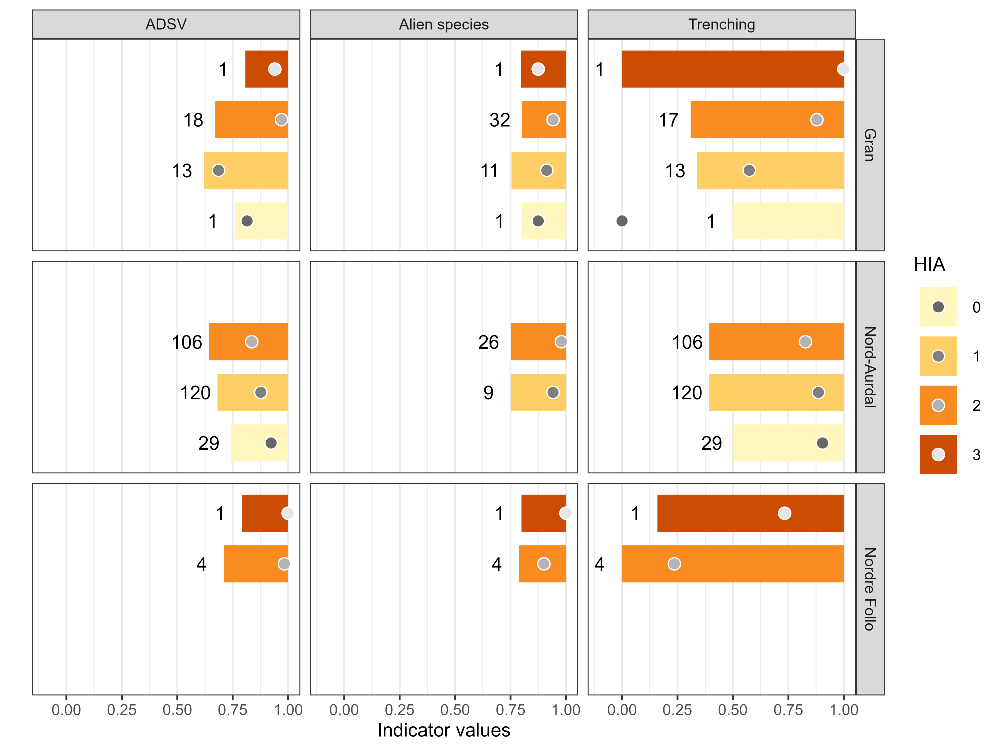
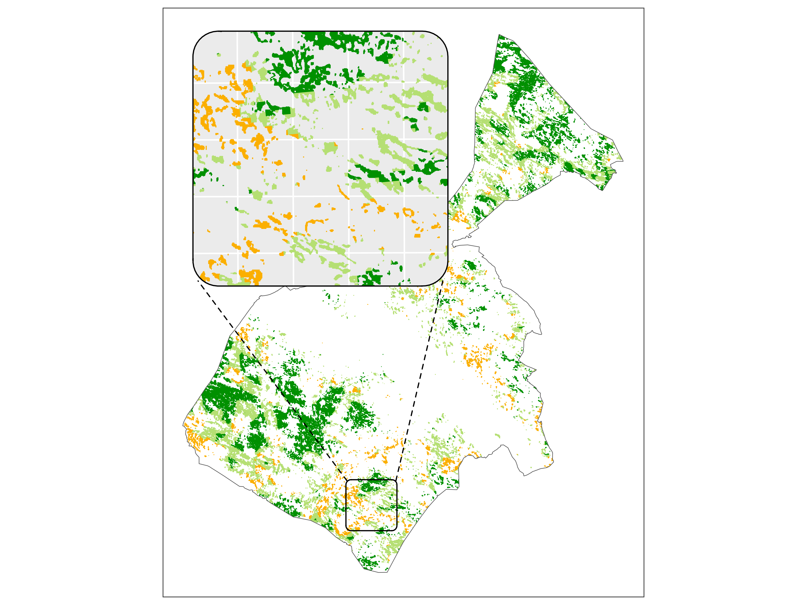
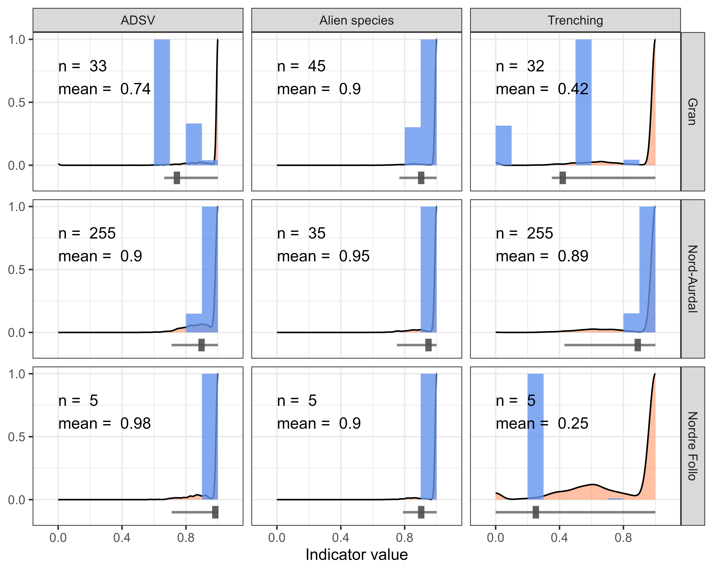

```{r setup}
#| eval: true

library(conflicted)
conflict_prefer_all("dplyr", quiet =T)
library(knitr)
library(here)
library(tidyverse)
library(targets)
tar_config_set(store = here::here("_targets"))
library(sf)
library(tarchetypes)
```


# Introduction

<!-- Ecosystem accounting, ecosystem condition, metrics, purpose, point estimates -->

Ecosystem condition accounting (ECA) is the structured compiling and communication of data on the status of ecosystems [@comte2022; @edens2022].
Its purpose is support policies, landuse planning and management decisions, and making it easier to account for nature by making the environmental costs of certain policies and practices visible to decision-makers.
The System of Environmental-Economic Accounting - Ecosystem Accounting (SEEA EA) is the most widely used framework for ecosystem accounting [@comte2022]. 
It was developed by the UN and adopted by the UN Statistical Commission as a statistical standard for ecosystem accounting in 2021 [@unitednations2024].
This framework provides a set of rules, principles and best practices for compiling ecosystem accounts, including ecosystem condition accounts (ECAs) [@unitednations2022].
At its core is the idea that data on ecosystem condition can be summarised in the form of summary statistics for selected metrics presented in generalised tables that describe the condition of a specific area referred to as the ecosystem accounting area (EAA).
Metrics are either classed as condition variables or as indicators.
Condition variables describe certain ecosystem characteristics deemed important for ecosystems in good condition, and they are typically in their original units of measurement, or as ratios. 
Condition indicators on the other hand, are always on a dimensionless scale between 0 and 1, representing a gradient of deviation from a reference condition (indicator value of 1) towards a completely deterriorated ecosystem (indicator value 0).
The reference condition is what the current condition is compared against, and its definition can vay according to the ecosystem type or the aim of the account.
Typical reference conditions are defined as something like an "intact ecosystem".

<!-- Local ECAs, data availability issues  -->

SEEA EA have intentional similarities to national accounts, which deal with the economic activity at the scale of nations.
Unsurprisingly then, SEEA EA accounts have mainly been used at national scales [@czucz_no_2025].
However, there is a surge of new examples of regional, municipal and project level accounts, motivated at least partly by the need to match the scale of the information to the scale of decision-making processes [@simensen_naturregnskap_2024; @gorman_decision_2024].
Although data shortages are ubiquitous for ECAs [@maes_review_2020], they may be especially prominent at local scales.
As we shall see, there are important differences between a typical national scale ECA and a more local ECA in what type of data they have available to them and in how the available data can and should be used to design condition variables or indicators that are relevant (e.g. have relevant resolutions, accuracy and precision) and mathematically defensible (e.g. provide unbiased estimates).

One such difference is the use of point observations or sample data from field campaigns. 
Many environmental monitoring programmes are designed to give robust design-based estimates of their target variables only at regional or national scales [@shannon_toward_2024].
Therefore there will typically not be enough data points for robust local inference from such data using design-based estimation methods, 
and one would need to explore different types of predictive modelling and approaches from within the field of small area statistics.
In small area statistics, the local estimates are informed by data from outside the local area, something referred to as _borrowing strength_ [@ghosh1994; @guldin2021]. 
This may raise concerns in some cases about the relevancy of the condition metric when its estimated value is purely synthetic and _out of sample_ [@vogt_spatial_2023].
As a consequence, local ECAs may not be able to leverage data from large nature monitoring programs, or if they wanted to, 
they would find scarce relevant guidelines for how to tackle this _out of sample_ problem.

<!-- spatial bias and data projection issues -->

The SEEA EA is designed as a spatial accounting framework, meaning condition metrics should ideally be recorded (or modeled) for all contiguous spaces (patches) 
of a specific ecosystem type (a common definition of an *ecosystem asset*) [@nicholson_thomas_towards_2025].
Furthermore, ECAs are expected to provide a single estimate (a point estimate) for its condition metrics that represents the entire EAA and the the whole reporting period, 
and give an unbiased spatial representation of the condition for a given area [table 1 in @czucz_selection_2021; see also @unitednations2024 §2.87].
For sampled (i.e. non-exhaustive) data, this requires some projection of data to cover ecosystem assets where they are not recorded.
In the ecosystem service accounting community of practice, this is often referred to as *value transfer* [@grammatikopoulou2023; @barton2023].
A subsequent area-weighted mean for the EAA will produce the point estimate [@unitednations2024 §5.54].
We refer to this process as upscaling — synthesising fine-grained data to characterise larger areas [@bierkens2002; @kolstad_spatial_2025].
Methods for upscaling include aggregation (e.g. arithmetic means), sampling [@brus1997] or resampling techniques [@jakobsson2021].
For simplicity we refer to all of these as aggregation, as the end result is the same — a synthesis of information.
Upscaling is required to make the information available for decision makers or monitoring frameworks at the appropriate spatial scale [@king2024; @ewert_scale_2011].
The point estimate will be biased if the underlying data is biased (e.g. due to preferential sampling) and if it is not statistically controlled for.
Spatial bias is then defined as when data are sampled without a known or reproducible sampling design, 
and in contrast to spatially representative data, which do have such a design.
Spatial bias in field data are especially problematic if sampling intensity correlates with anthropogenic pressures (and thus ecosystem condition) [@aubry2024].

In contrast to sampled field data, remote sensing offers wall-to-wall data which are spatially representative through the property of being spatially exhaustive [@williams_overcoming_2024], 
and automatically gives data for all ecosystem assets.  
For local applications, however, it is worth noting that grain size also plays a role 
in the sense that important ecological information may be averaged out within a pixel (cf. the ecological fallacy [@robinson2009]). 
Remote sensing is the dominating data source for ecosystem condition mapping of forests and urban ecosystems, and is prevalent also for most other ecosystems [@nicholson_thomas_towards_2025].
However, many critical ecosystem characteristics - such as species composition, soil properties, or fine-scale habitat features - cannot be directly measured using remote sensors 
and still require field surveys [@nicholson_thomas_towards_2025].

<!-- So we have another difference between national and more small-scale ECAs, and its related to the use of spatially biased, or preferrentially sampled data. -->
National ECAs may simply choose to ignore data with known spatial biases on the grounds that they are unrepresentative for the total area of the target ecosystem,
or they may leverage statistical tools that aims to overcome the original sampling bias, such as geostatistics [@diggle_geostatistical_2010].
However, as we just saw, small-scale ECAs may be more eager to use such inherently biased datasets 
due to the above issue with using data from national monitoring programs, which could otherwise provide overlapping information.
Being able to make use of spatially biased data would greatly alleviate data shortage problems in local ECAs.

<!--  types of projection aprpaches/models -->
@unitednations2022 list six relevant approaches or modeling techniques for projecting metric values to ecosystem assets without field data: 
look-up tables; spatial interpolation (e.g. inverse distance weighting); geostatistical models (e.g. kriging); 
statistical models (e.g. regression); dynamic system models (many types of process-based models); and machine learning (e.g. random forest).
Some of these models could also be used to control for sampling biases [@diggle_geostatistical_2010].
Depending on the data that goes into them, models can make very accurate estimates, especially when the areas are large (e.g. regions or nations), 
but their reliability diminishes for smaller areas (e.g., municipalities) due to data scarcity and model uncertainty [@venter2024].
There is, however, a lack of guidelines in the SEEA EA for how to address this _out of sample_ issue.
We posit that ecosystem accounts should ideally be as specific as possible to the conditions inside the accounting area,
and that they are arguable more useful when reflecting local management and land use policies, unaffected by the actions of neighboring or ecologically similar administrative units.
There might therefore be a limit to how much data one should "borrow" across ecosystem assets or EAAs.

<!-- What about the errors -->
Spatial aggregation allows for the quantification of spatial variance in the estimate.
In addition, there can be measurement or modeling errors that could potentially also be propagated and reported alongside the upscaled estimate [e.g. @heris2021].
Currently, SEEA EA lacks guidelines for estimating or disclosing any type of numerical uncertainty,
and a recent systematic review found that a quantitative measure of uncertainty was included in only 9% of the published condition indicators [@nicholson_thomas_towards_2025].
This could potentially undermine the credibility and finally the uptake of knowledge from ecosystem accounting [@bagstad2021; @venter2024].
Local ECAs face a unique side of this problem because sample sizes are frequently so small that traditional arithmetic estimates of variance are unreliable.
In addition, calculating variances is even more data demanding when metrics are truncated, such as for indicators bound between zero and one.
In such cases, a small sample size can by chance contain only or predominantly ones (or zeros), resulting in an artificially small variance which will then paradoxically increase as sample sizes increase due to the inclusion of more data points from the tail of the distribution.


<!-- A poor solution, which doesn't attempt to control for sampling biases, is to ignore unsampled areas by directly estimating values for the entire EAA via central tendencies (e.g. means).
This solution is the simplest type of spatial generalisation and 
relies on the assumption that the value of the variable of interest at unmeasured locations 
are the same as in “nearby” measured ones, which may be very far from reality. -->

<!-- Look-up tables, the simplest approach, assign the same value across categorical strata (e.g. ecosystem type within a region), often with no uncertainty estimate (although this is quite possible to include).
Values may derive from expert opinion or aggregated data (e.g. stratum means).
If strata align with relevant gradients in pressures or environmental conditions, this method can mitigate sampling bias via post-stratification.
The level of spatial or environmental extrapolation is subject to the size of the strata, with fine-grained typologies leading to less extrapolation.
Extrapolating non-continuous spatial data (e.g. points) over a surface is also a type of spatial generalisation. -->

<!-- Direct estimation and post-stratification -->


<!-- Objective: Here we try to find a solution to the problem where municipalities want ECAs that are independent of the ecosystem condition outside its borders, but where small samples and preferential (biased) sampling makes it difficult -->

In this study we raise the question of how to design ecosystem condition indicators for municipal scales from sparse and spatially biased data.
We also worked from the assumption that the point estimates cannot simply be extrapolated from data colled outside the EEA,
and that all point estimates must come with numerical uncertainty descriptions.
Our solution was to combine a direct estimation of the point estimates using post-stratification,
with an empirical Bayes variance smoothing approach to predict indicator uncertainties, 
where we borrow strength from a larger national dataset.
This allows us to get a point estimate that using local data only, but also to get a realistic picture of indicator uncertainty 
even when sample sizes were very low.
We demonstrate these techniques with three indicators from the same spatially biased nature type mapping data set from Norwegian mires, 
comparing results across three municipalities in Norway to illustrate their potential for local applications.
Finally we discuss pros and cons of the resulting indicators in terms of how they fulfil the selection criteria for ecosystem condition indicators 
in the SEEA EA [@czucz_selection_2021]. 
<!-- also practicalities in the calculations, data-to-indicator pipeline, credible, salient and legitimate.
E.g. still not suited for project level management, eg find restoration areas 10.1016/j.cosust.2018.03.014 -->


<!-- We present two techniques for direct estimation of local ecosystem condition indicators using scarce and spatially biased data.
Firstly, we demonstrate a stratified aggregation technique, using homogeneous impact areas, to reduce the negative consequences of spatial and environmental bias in the data.
With this we get direct indicator point estimates using area-weighting and local data only.
Second, we use an empirical Bayes variance smoothing approach to predict indicator uncertainties, where we borrow strength from a larger national dataset.
This allows us to get a realistic picture of indicator uncertainty even though sample sizes are very low.
We demonstrate these techniques with three indicators from the same spatially biased nature type mapping data set from Norwegian mires, comparing results across three municipalities in Norway to illustrate their potential for local applications. -->


<!-- The issue of representativeness extends beyond spatial biases to include thematic biases—such as the under-representation of key ecosystem components like insects or soil biota.
Also, having data from only one or a subset of nature types inside what is defined as the ecosystem in the assessment, is a typical thematic bias in ecosystem accounting.
However, this paper focuses on spatial (geographic and environmental) bias. -->


# Material and Methods {#sec-methods}

We used a spatial dataset of nature types in Norway [@norwegian_environmental_agency_naturtyper_2024], surveyed in the field following a standardised protocol [@norwegian_environmental_agency_protocol].
The dataset comprises over 140,000 polygons (as of 2023), each scored on several variables describing ecological condition and qualities.
The data collection is spatially biased, typically towards areas with high human impact or expected impact.
This is by design, as the survey is meant primarily to support land-use decisions in areas where there might be a conflict or just a general data shortage. 

Although the dataset covers many different nature and ecosystem types, we chose to focus on mires. 
This was because a large fraction of Norwegian mire types are included in the survey, 
and because the set of condition variables recorded for these types generally overlapped quite well. 
Because, also, Norwegian mires share a lot of characteristics and anthropogenic pressures, 
this allowed us to combine data from several mire nature types into a common _mire_ ecosystem type.

Mires cover about 10-15% of mainland Norway and play a disproportional role in climate mitigation due to their large carbon stores [@Scharlemann01022014].
To delineate open mire ecosystems we used a remote-sensing derived map which estimates 12.7% of the area in southern Norway is mire [@bakkestuen_delineation_2023].
There has not been a national assessment of the ecosystem condition of mires in Norway, but the authors recently contributed to a report which presented several new indicators that can be used in future national assessments for this ecosystem [@nybo_indikatorer_2023; see also @kolstad2023]).
The current study builds on the work in that report.

<!-- ## Data source and survey design -->

The field mapping protocol [@norwegian_environmental_agency_protocol] introduces thematic and sizes biases.
For mires, this implies an elevated focus on calcareous and medium to large mires.
The survey maps the following mire types which we use in our analyses:

-   Southern bogs (ombrotrophic mires) \> 2500 m^2^

-   Northern bogs \> 10.000 m^2^

-   All semi-natural mires \> 1000 m^2^

-   Calcareous southern fens (minerotrophic mires) \> 500 m^2^

-   Calcareous northern fens \> 1000 m^2^

Here, *southern* refers to boreonemoral and southern boreal zones, and *northern* refers to mid-boreal, north boreal, and alpine zones [@asbjørnmoen1998].
In addition to requiring a large size, northern fens also require higher calcareousness, compared to southern fens, to be surveyed [@norwegian_environmental_agency_protocol].
Data from 2018 to 2023 were included.

We treat the surveyed mires as representative for the broader mire ecosystem inside the surveyed areas
and posit that our selected variables (see below) are relatively unaffected by the biases declared above,
related to undersampling of smaller and less calcareous mires.
A possible exception to this is for alien plant occurrences, 
which are probably less common on bogs, but the variable is recorded only in fens.
The other variables are recorded in all delineated mires.

## Indicator development

Six raw variables (@tbl-variables, variables 1—6) were normalised and turned into three condition indicators [sensu @unitednations2024]:

-   *Alien species* (7FA)

-   *Trenching* (7GR-GI).

-   *ADSV* (*Anthropogenic disturbance to soil and vegetation*; combined from variables 7SE, PRSL, 7TK and PRTK)

Normalisation followed a piece-wise linear transformation with three reference levels [@czúcz; @jakobsson2020]

-   X~100~: Best possible condition (minimal human influence)

-   X~0~: Worst possible condition

-   X~60~: defining the threshold between good and poor condition.

The reference levels make up a numerical representation of the reference condition.
We define the reference condition as one where ecosystems are subject to little or no human influence, with a climate as in the period 1961-1990 and a native species pool similar to today [@jakobsson2021].
For details about the normalisation process, see Appendix A.

```{r fig-studyLocation2}
#| eval: true
#| include: true
#| out.width: '80%'
#| fig.cap:
#| - "Map of the three focal municipalities. Note that for the mapped mires 
#| in red, the polygon borders are made extra thick to make them visible,
#| but then also exaggerating their size.
#| The bottom row shows the delineation for homogeneous impact areas which
#| is an ordinal gradient from 0–3 with increasing presence of human 
#| infrastructure."


```

\pagebreak

## Homogenous Impact Areas

To correct for spatial bias we used spatial information about human pressures, as an expected structuring variable, to post-stratify the data.
The Norwegian infrastructure index for the year 2022 is a continuous variable representing the frequency of different infrastructure types inside 500 m radius circles around each 100 × 100 m pixel [@erikstad_index_2023].
We categorised the infrastructure index map into four non-overlapping Homogeneous Impact Areas (HIAs; @tbl-variables), with boundaries chosen to balance gradient resolution, data stratum area, and computational limitations (Table S1).
We did a visual exploration to check if the HIAs had any explanatory power over the indicator values in te national dataset, 
For this purpose we used an aggregated 1 × 1 km version of the infrastructure index map, to ease computations.

HIAs align conceptually with the concept of Homogeneous Ecosystem Areas, *sensu* @vallecillo_eu-wide_2022.
The nature type polygons with the indicator values were intersected with a vectorised HIA map and the relationship between the HIA classes and indicator values was examined visually across the entire data set.

### Municipal-level analyses and spatial aggregation

Three municipalities were selected to test the indicators, varying in mire area, survey coverage, and infrastructure prevalence (@tbl-munis, @fig-studyLocation2, S3, S4).
For each HIA - municipality (strata) combination we calculated the area-weighted arithmetic mean of the indicator and used a look-up table approach to transfer these values to all ecosystem assets in the same strata.
Ignoring strata with no data, we then took another area-weighted mean across all ecosystem assets inside the municipality to get the point estimate.

The three indicators where all highly left skewed with strong 1-inflation (a disproportionate amount of the surveyed mires had indicator value 1).
It was therefore essential to describe the indicator uncertainty using non-symmetrical errors.
It also makes sense for a bound indicator not to have errors exceed the bounds.
The sample size for each stratum, excluding those with no data, ranged between 1 and 145, yet we wanted a generic approach that allowed us to include reliable uncertainty estimates for all cases.
Our solution was to use the entire national dataset, divided into the four HIAs, to describe the indicator distributions as zero- and one-inflated beta distributions.
We recorded the frequency of zeros and ones in the data as a measure of zero- and one inflation, respectively.
For values between, but not including, zero and one, we used maximum likelihood estimation to get the two shape parameters for a beta distribution.
We did the same for the local strata, although the estimation of the shape parameters requires a certain sample size and dispersion of data values to converge, making it impossible to describe the samples for some strata as a distribution.
When the local sample sizes where too low for religable estimates of variance, 
we adjusted the local sample variances using an empirical Bayes variance smoothing technique for small area estimation.
This implied combining prior information about the shape of the national-level data with the local strata data.
We used a prior weight of 20, meaning the national data informed the shape of the local indicator distribution with similar weight as 20 local data points.
The prior weight was chosen after some trial and error to find a suitable weight that balanced local autonomy with realistic distributions, and with less 1-inflation, a smaller prior weight could have been used.
Still, the prior weight was low enough that all point estimates (calculated independently from the predicted distributions) fell inside the 95% credible intervals.
The predicted distributions were transferred over to the ecosystem assets of the corresponding strata, and from there, values where sampled proportional to asset area to obtain a probability distribution for the EAA (@fig-workflowExample - C).

All the data preparation and analyses were done in Positron [@positron] and R version 4.5.0 [@rcoreteam2023], relying heavily on the packages tidyverse [@wickham2019], sf [@pebesma2018], terra [@Hijmans23] and stars [@pebesma2023].

\pagebreak

\blandscape

| id | Variable code | Variable name | Measurement unit | Description | Reference |
|------------|------------|------------|------------|------------|------------|
| 1 | 7FA | Prevalence of alien species | Unit-less, ordinal, non-linear scale from 1 (no alien species) to 7 (only alien species) | The fraction of the species composition made up from alien species | @runehalvorsen2019 |
| 2 | 7SE | Human caused abrasion or abrasion-caused erosion | Unit-less, ordinal, non-linear scale from 1 to 4. | Measures the frequency of imagined 4 m^2^ quadrats laid over the area that has some sign of abrasion | @runehalvorsen2019 |
| 3 | PRSL | *as above* | Unit-less, ordinal, non-linear scale from 0 to 7. | Same as 7SE, but recorded at a higher resolution | @norwegian_environmental_agency_protocol |
| 4 | 7TK | Tracks from large vehicles | Unit-less, ordinal, non-linear scale from 1 to 4. | Measures the frequency of imagined 100 m^2^ quadrats laid over the area that has some signs of vehicle tracks | @runehalvorsen2019 |
| 5 | PRTK | *as above* | Unit-less, ordinal, non-linear scale from 0 to 7. | Same as 7TK, but recorded at a higher resolution | @norwegian_environmental_agency_protocol |
| 6 | 7GR-GI | Trenching intensity | Unit-less, ordinal scale from 1 to 5 | Describes the effect that drainage ditches is estimated to have on the species composition and environmental variables once the system reached its new equilibrium | @norwegian_environmental_agency_protocol |
| 7 | Infra-structure Index | Infrastructure Index | Unit-less linear scale from 0 to 13.2 | Unit-less index ranging from from 0 to 13.2 | @erikstad_index_2023 |
| 8 | HIA | Homogeneous Impact Area | Ordinal, non-linear scale from 0 to 3 | A categorical representation of the infrastructure index | this paper |

: Variables used in this study {#tbl-variables} {tbl-colwidths="\[5,10,15,25,25,20\]"}



```{r get_muni_tbl}
#| echo: false
#| eval: true
tar_load(muni_tbl)
```

| Municipality | Total terrestrial area (km^2^) | \% of terrestrial area surveyed | \% open mires in relation to total terrestrial area | Total mire area (km^2^) | %of mire area inside survey area | Number of mire polygons in survey | Mean Infrastructure Index value |
|---------|---------|---------|---------|---------|---------|---------|---------|
| Nordre Follo | `r muni_tbl |> filter(Municipality == "Nordre Follo") |> pull(t_area_km)` | `r muni_tbl |> filter(Municipality == "Nordre Follo") |> pull(dk_percent)` | `r muni_tbl |> filter(Municipality == "Nordre Follo") |> pull(mirePercent)` | `r muni_tbl |> filter(Municipality == "Nordre Follo") |> pull(mire_km2)` | `r muni_tbl |> filter(Municipality == "Nordre Follo") |> pull(mireInSurvery_percent)` | `r muni_tbl |> filter(Municipality == "Nordre Follo") |> pull(n)` | `r muni_tbl |> filter(Municipality == "Nordre Follo") |> pull(meanHIA)` |
| `Gran` | `r muni_tbl |> filter(Municipality == "Gran") |> pull(t_area_km)` | `r muni_tbl |> filter(Municipality == "Gran") |> pull(dk_percent)` | `r muni_tbl |> filter(Municipality == "Gran") |> pull(mirePercent)` | `r muni_tbl |> filter(Municipality == "Gran") |> pull(mire_km2)` | `r muni_tbl |> filter(Municipality == "Gran") |> pull(mireInSurvery_percent)` | `r muni_tbl |> filter(Municipality == "Gran") |> pull(n)` | `r muni_tbl |> filter(Municipality == "Gran") |> pull(meanHIA)` |
| `Nord-Aurdal` | `r muni_tbl |> filter(Municipality == "Nord-Aurdal") |> pull(t_area_km)` | `r muni_tbl |> filter(Municipality == "Nord-Aurdal") |> pull(dk_percent)` | `r muni_tbl |> filter(Municipality == "Nord-Aurdal") |> pull(mirePercent)` | `r muni_tbl |> filter(Municipality == "Nord-Aurdal") |> pull(mire_km2)` | `r muni_tbl |> filter(Municipality == "Nord-Aurdal") |> pull(mireInSurvery_percent)` | `r muni_tbl |> filter(Municipality == "Nord-Aurdal") |> pull(n)` | `r muni_tbl |> filter(Municipality == "Nord-Aurdal") |> pull(meanHIA)` |

: Information for the three target municipalities in Norway {#tbl-munis}

\elandscape

# Results

## Indicator validity and trends in Norway

```{r get_naturetypes}
#| eval: true
#| echo: false
tar_load(naturetypes_norm)
```

The three indicators generally showed a worsening of condition with increasing presence of human infrastructure when we looked at data from all of Norway with `r nrow(naturetypes_norm)` individual mires (@fig-validation).
This relationship was much stronger for the indicator *Trenching*, and weakest for the indicator *Alien species*.
*Alien species* also had the highest indicator values overall, with most mires having no alien species recorded.
For *Trenching*, 57% of mires in HIA-3 had some trenches, whereas in HIA-0 this number was 10%.

## The three focal municipalities

The indicator values were comparable across HIAs in the three municipalities, although there were some differences.
For example the *Trenching* indicator, which in the municipality of Gran, had a slightly lower value (more trenches) in areas with more human infrastructure (@fig-forest).
Conversely, the *ADSV* indicator in Gran showed slightly higher values (better condition) in areas with more infrastructure, but the uncertainty around the point was large (horizontal bars in @fig-forest).
Nordre-Follo had considerably fewer data points compared to the other two municipalities and the the 95% credible intervals are therefore mainly reflecting the indicator distribution nationally.

None of the municipalities had survey data from all HIAs.
Therefore, when we transferred the point estimates and the predicted indicator values for each HIA (@fig-forest) over to the ecosystem delineation map (@fig-spread-example), some mire polygons in the ecosystem delineation map did not get assigned any data, and were therefore not included (i.e. did not have any influence on) the following aggregation to ecosystem accounting areas (EAA) (@fig-workflowExample, E) .

At the municipality level (i.e. the EAA level) the indicators generally showed good ecological condition (i.e. values \>0.6) and point estimates ranged between 0.79 and 0.98, with the exception of *Trenching* in Nordre Follo which had 0.24 (@fig-EEA-ridgePlot; Table S2).
Nordre Follo also had the highest (the best) indicator values for one of the indicators (ADSV); probably reflecting stochasticity due to low sample size .

```{r fig-workflowExample}
#| eval: true
#| include: true
#| out.width: '100%'
#| fig.cap:
#| - "Simplified schematic showing the workflow (Panes A-E) for spatial generalisation of a spatially biased ecosystem condition indicator. Pane A shows in red the data coverage of a patchy and spatially biased indicator. Surveyed areas are grey and unsurveyed areas are green. Together they make up the ecosystem accounting area (EEA). Pane B shows the location of four homogeneous impact areas (HIAs) inside the EEA, where the prevalence of human infrastructure increases from 0 to 3. The indicator values in Pane A are used, in combination with the HIA map in Pane B, to calculate the area-weighted point estimates shown as grey circles in Pane C.  The errors surrounding the point estimate are calculated independently from the point estimate via an emipircal Bayes approach as predicted distributions (show in Pane C as 95% credible intervals (CI)) informed with prior knowledge about the shape of the distribution of indicator values (a zero- and one-inflated beta distribution in this case) for a larger area, i.e. outside the EAA. Note that because in this example there were no indicator data for HIA-3, indicator values are only aggregated for HIAs 0-2. In Pane D the point estimates and sampled distributions are transferred to individual polygons in an ecosystem delineation map, for each HIA separately. The colours indicate different point estimates (highlighted in the inset). Pane E shows area-weighted indicator values aggregated to the EAA level.  Blue vertical bars show the area distribution of indicator values after they have been extrapolated to an ecosystem delineation map (Pane D). The orange density curve show the predicted indicator values informed both by local samples from inside the EAA and from a larger national dataset (indicator weight was 20, meaning the national data had the same influence on the predicted distribution as 20 local samples). The area-weighted mean and 95% CI are shown at the bottom as a thick vertical bar and thin horsontal line, respectively. The mean is informed by the local data only (blue bars) and the 95% CI is a summary of orange distribution."

knitr::include_graphics("images/aggregation-workflow.png")

```

```{r fig-validation}
#| eval: true
#| include: true
#| out.width: '90%'
#| fig.cap:
#| - "Proportion of localities with different indicator values for three 
#| ecosystem condition indicators along an ordinal gradient of increasing
#| infrastructure densities (Homogeneous Impact Areas 0–3). 
#| The data is from a national nature type survey in Norway. ADSV = Anthropogenic disturbance to soil and vegetation." 


```

```{r fig-forest}
#| eval: true
#| include: true
#| out.width: '80%'
#| fig.cap:
#| - "Indicator values (circles = mean; bars = 95% credible intervals) for three
#| mire ecosystem condition indicators (rows) 
#| in three Norwegian municipalities (columns).
#| The indicator values 
#| are calculated uniquely for each Homogeneous Impact Area (HIA) in each 
#| municipality. The numbers to the left of each bar is the sample size, i.e. 
#| the number of surveyed mires. ADSV = Anthropogenic disturbance to soil and vegetation."  


```

```{r fig-spread-example}
#| eval: true
#| include: true
#| out.width: '80%'
#| fig.cap:
#| - "An indicator for mire trenching shown for Nord-Aurdal municipality. 
#| Individual mire polygons are coloured by the mean indicator values for the
#| homogenous impact area where it lies. Colours are chosen to best reflect 
#| categorical differences and exaggerates the absolute difference between 
#| areas. The inset is 5 km across and shows the typical size and shape of mire polygons, and how indicator values can vary between them. Coordinate reference system is 
#| EPSG 25832."


```

```{r fig-EEA-ridgePlot}
#| eval: true
#| include: true
#| out.width: '80%'
#| fig.cap:
#| - "Distributions for three ecosystem condition indicators in three Norwegian 
#| municipalities. 
#| Blue vertical bars show different bins of indicator values (width 0.1) and how much area on the ecoystem delineation map they cover after being extrapolated to areas with no field data. Orange density curves show the predicted indicator values informed both by local samples from inside the EAA and from a larger national dataset. The area-weighted mean and 95% credible intervals are shown at the bottom as a thick vertical bar and thin horsontal line, respectively. The mean is informed by the local data only (blue bars) and the 95% CI is a summary of orange distribution. ADSV = Anthropogenic disturbance to soil and vegetation."

# Histogram smoothing makes it look like there are more data points beyond the lower and upper percentiles than there really is. The 2.5% percentile sometimes looks like the 25% percentile. 


```

# Discussion

This paper presents a generalisable workflow to address two critical challenges in local ecosystem condition assessments (ECAs): (1) mitigating spatial and environmental bias in scarce field data, and (2) quantifying realistic uncertainties for small-sample indicators (@fig-workflowExample).
Our approach combines direct estimation (to preserve local representativeness) with empirical Bayes variance smoothing (to stabilise uncertainty estimates), offering a pragmatic solution for municipalities where data limitations hinder robust assessments.
Below, we discuss the strengths and limitations of our two core innovations: post-stratification using Homogeneous Impact Areas (HIAs) and variance smoothing for small-area statistics.
The two approaches can also be used independently.

## Post-stratification using HIAs

Local ECAs often rely on opportunistic datasets that lack spatial representativity.
Our post-stratification method addresses this by partitioning data into HIAs — homogeneous impact areas (e.g., infrastructure prevalence) — ensuring indicators are estimated and extrapolated only within comparable contexts.
This minimizes extrapolation bias while retaining interpretability.
HIAs have the advantage of simplicity [@czucz_selection_2021], 
are particularly valuable for local ECAs, where small samples preclude complex geostatistical methods (e.g., kriging).
A similar concept called homogeneous ecosystem areas was introduced by @vallecillo_eu-wide_2022 and refer to parts of an ecosystem type that can be allowed to share common reference levels.
HIAs on the other hand, refer to areas that can be allowed to share common indicator values.

The effectiveness of HIAs depends on their alignment with indicator dynamics.
For instance, infrastructure prevalence strongly predicted trenching impacts in mires but weakly explained alien species occurrence (@fig-validation).
Stratification generally leads to better estimation [@brus_spatial_2022], but 
using uninformative stratification variables will only lead to a reduce sample size per stratum. 
However, we see little risk with using HIAs even when relationships are weak, 
but note that not accounting for other, potentially more relevant predictors of indicator values, can leave the indicator as spatially biased as the original variable.
For the alien species occurrence indicator, HIAs did not predict indicator values to any large degree, neither nationally (@fig-validation) nor locally (@fig-forest). 
Other stratification variables could have been explored, e.g. latitude, as there are generally more alien species in the south compared to the north in Norway.

At the national scale, indicator values (and hence ecosystem condition) generally decreased as human infrastructure increased,
and especially so for the trenching indicator (@fig-validation).
However, this pattern was reversed inside Gran municipality 
where trencing was most severe in areas further away from infrastructure (@fig-forest).
In Gran, the sample sizes are relatively small (e.g. only one sample inside each of HIA-0 and HIA-3),
and this makes it difficult to draw any clear conclusion about this pattern.
So although HIAs can reveal spatial patterns in degradation, 
concluding that ecosystem condition is better or worse in one HIA over another, 
requires a sample size bigger than what we have for Gran. 

## Uncertainty quantification for small samples

An accounting indicator is of little decision-support value without a measure of uncertainty,
Without which it is not possible to determine with confidence whether there has been a real change in a condition variable  in response to human pressure, regeneration or restoration.
However, there is a general lack of guidelines for estimation and disclosure of uncertainties in the SEEA EA statistical standard [@venter2024], and indicator values are often reported simply as opening and closing values.

With low strata level sample sizes, typical of local ECAs, 
any attempt to describe the variation in the population (the strata) becomes uncertain.
This problem get bigger if the variable is highly skeewed and
traditional variance estimates fail for truncated or skewed indicators, where limited sampling can artificially inflate precision.
Our approach in these cases was to use the variation in the national population as a proxy for the variation in the local strata (which we refer to as "borrowing strength"), 
and then gradually, as sample sizes increase, let the variation get described more and more by local data only.
This allows us to have a measure of uncertainty, even when the sample size normally would not allow a reliable estimation of such.
Although this approach cannot eliminate the inherent stochasticity of sparse data, it contextualises estimates within plausible value ranges, supporting decision-making.
As sample sizes grow, local data dominate the uncertainty estimates, making the method adaptable across scales.
This can be seen as a type of small-area inference of uncertainty, but unlike other small area statistical application,
we have discoupled this process of uncertainty estimation from the estimation of the point estimate,
which are estimated directly using only data from inside the EAA to ensure indicators reflect local condition. 

Returning to the example of trenching in Gran municipality, 
the sample sizes are so small for two of the HIA stratum
that the local data have little influence on the predicted indicator range, 
which instead becomes determined mainly by the national data. 
Subsequently, because of the way the estimation of the point estimates and the predicted ranges are discoupled,
the point estimate for HIA-3 in Gran is outside the predicted range (the credible interval), 
indicating that this data point is likely to prove as an outlier if we increase the sample size.
With an increasing sample size, this is less likely to occur, because the local data will gain a larger infuence on the predicted ranges. 

Our results also point to where the data shortages are most pressing (HIAs with little or no data), and this information could be used to guide future data collection.
For example, across all three municipalities, there were only two mires recorded in HIA-0 (areas with lottle or no infrastructure); 
one in Gran and one in Nordre-Follo (@fig-forest). 
This reflects the spatial bias of the field survey, and highlighting this data shortage 
could make these areas a priority in upcoming field campaigns in order to get more complete spatial indicator coverage.

## Indicator values in pilot municipalities

The values for the indicators *ADSV* and *Alien species* showed in general a good condition in mire ecosystems across the three municipalities (@fig-EEA-ridgePlot).
However, *Trenching* in Nordre Follo (indicator: 0.25, *n* = 5) and in Gran (indicator = 0.43, *n* = 32) was well below the threshold for good ecosystem condition (0.6).
The predicted indicator distributions for these two cases, is higher, suggesting the indicator value might rise with additional sampling, but the direct estimate — uninfluenced by national data — reflects local realities.
Nordre Follo has surveyed more of its total land area compared to the other two municipalities, but has less mire area to begin with (@tbl-munis), which is the reason for this low sample size.
Nordre Follo’s limited mire area underscores the value of our small-area methods.

Mire condition in Norway has not been assessed at a national scale.
Still, we know that they are subject to multiple threats, especially land conversion into agriculture, forestry, or development, and we see this reflected in the Norwegian Red List for Nature types where many ombrotrophic bog types, and rich southern minerotrophic fens are listed [@artsdatabanken2018].
Land conversion of mires is often initiated with trenching to lower the water table but note that our *Trenching* indicator does not document the effect of trenching on old mires that have transitioned into another ecosystem.
This is in line with the UN standard for ecosystem accounting, where these effects should be captured by the extent accounts [@unitednations2024].
Therefore, the negative consequences of trenching on all Norwegian mires, old and current, must be higher than what our indicator is made to show, most likely considerably higher.

Alien species risk is not considered a threat to any of the Norwegian mire types, and our results confirm this, at least for the present (@fig-EEA-ridgePlot).
Motorised vehicle traffic and other forms of human transportation are also threats listed for some mire types in the red list assessment, and we see some reduction in the ADSV indicator, more so in Gran and in areas closer to infrastructure (@fig-forest).
Still, the indicator values are consistently above the threshold value for good ecological condition (@fig-EEA-ridgePlot).

# Conclusion

By integrating post-stratification and empirical Bayes variance smoothing, we enable local ECAs to leverage imperfect datasets while maintaining transparency and local relevance via direct estimation.
Our methods address fundamental challenges in ecosystem accounting: spatial bias correction and uncertainty quantification for small samples.
As SEEA EA matures, we urge greater emphasis on uncertainty reporting and robust aggregation techniques.
We have demonstrated approaches that are new or relatively new to the ECA field of practice but well established in other fields of statistics.
This work demonstrates that sparse data can still be useful for ecosystem accounting, as long as one can describe the uncertainties around local estimates in a sound and religable way.

# CRediT authorship contribution statement {.unnumbered}

**Anders L. Kolstad**: Conceptualization, Methodology, Software, Validation, Formal analysis, Data Curation, Writing - Original Draft, Visualization, Project administration, Funding acquisition.
**Matthew Grainger**: Validation, Writing - Review & Editing.
**Marianne Evju**: Conceptualization, Writing - Review & Editing.
**David N. Barton**: Funding acquisition, Writing - Review & Editing.
**Bálint Czúcz**: Writing - Review & Editing

# Declaration of Competing Interest {.unnumbered}

We have no competing interests to declare.

# Acknowledgements {.unnumbered}

We wish to thank Kwaku Peprah Adjei for statistical help, and Hanno Sandvik for code review.
We acknowledge partial funding from the Research Council of Norway project EcoGaps (contract #320042).

# Data availability {.unnumbered}

The source files and some of the data are located on GitHub (https://github.com/anders-kolstad/HIAs) with an archived stable version on Zenodo (doi:).
The exceptions are the large nature type survey data, which was downloaded locally, but which is freely available (see @norwegian_environmental_agency_naturtyper_2024), 
and the infrastructure index data, which is available upon request.
This manuscript is written in Quarto [@Allaire_Quarto_2025],
and the analysis is written as a targets workflow [@targets]. 
See files *_targets.R* and *R/functions.R* in the GitHub repository. 
The workflow is also described Appendix A.



# References {.unnumbered}

::: {#refs}
:::
