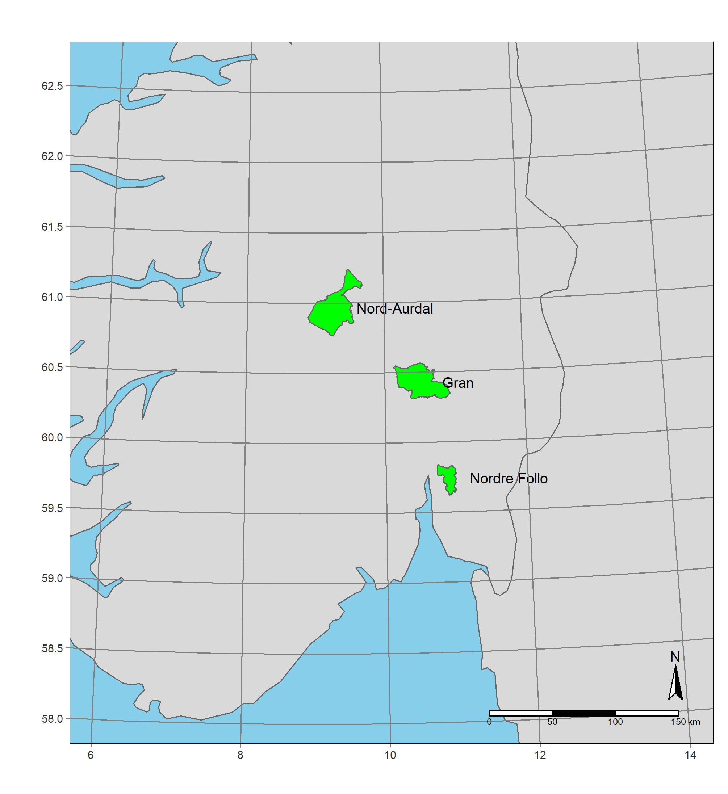

```{r setup}
#| include: false
library(knitr)
library(targets)
library(tidyverse)
library(tarchetypes)
library(sf)
tar_option_set(workspace_on_error = TRUE)
```

## Overview

The analyses are arranged into a pipeline, or targets workflow.
The workflow file is called *_targets.R*, and it relies on functions described in the file *R/functions.R*.
All the code is available on GitHub at https://github.com/anders-kolstad/HIAs with an archived stable version on Zenodo (doi:   ).
When running the workflow, the individual targets (outputs from functions) gets stored in a folder locally.
The manuscript, as well as this appendix document, is written in quarto.
We can then read the targets back into R and print or visualise them, which is what we have done in this current document, and we leave the R code visible to be explicit about where in the targets workflow we are extracting information.


@fig-c1 shows target named *test_most_common*, which is a plot showing the most common wetalnd nature types in Norway.
```{r fig-c1}
#| Ordered barplot showing the most common wetland nature types in Norway in terms of occurrence frequency.
tar_read(test_most_common)
```

@fig-c2 hows the distribution of variable values for the five variables extracted from the nature types dataset, after they have been converted to a percentage scale.
```{r fig-c2}
#| fig-cap: 'Distribution of variable values.'
tar_read(test_naturetypes_p)
```


The following snippet from the target *naturetypes_wide* shows how nature type polygons (rows) typically don't have all four of the variables underlying the ADSV indicator recorded. 
```{r c2x}
tar_read("naturetypes_wide2") |> head()
```

To combine these four variables into one metric, ADSV, 
one could take the one with the highest value (worst-rule), or the sum.
Summation is problematic as not all locations have two values to sum together. 
But the other option is problematic since field workers often tend to split the effects over two variables, 
if they have that option, so that the summed variable values matches what they persieve as the correct answer.
If we have 50% vehicle damage and 50% hiking damage, 
that is no doubt worse than having 50% of just one of them. 
So I will use the sum, despite its issues.

@fig-c3 shows the distribution of the two pairs of related variables after taking their sum, and @fig-c4 show the distribution after summing the two variables in @fig-c3.
```{r fig-c3}
#| fig-cap: 'Distribution of summed variable values for the two pairs of related variables 7SE-PRSL and 7TK-PRTK.'
tar_read(plot_naturetypes_comb)
```

```{r fig-c4}
#| fig-cap: 'Distribution of summed ADVS variable values.'
tar_read(plot_naturetypes_comb)
```

@fig-c5 shows the normalisation of three variables into a dimentionaless indicator scale. The scaling functions are non-linear for ADSV and 7FA, ensuring that 0.6 on the indicator scale corresponds to the variable values that makrs the threshold between good and reduced ecosystem condition.
```{r fig-c5}
#| fig-cap: 'Scaling function for normalising the three condition variables.'
tar_read(plot_normalised)
```


@fig-pos show the location of the three example municipalies included in this study.
```{r fig-pos}
#| fig-cap: 'Positio of the three municipalies analysed in this study.'

```


## Core tables

### Municipality summary

```{r}
muni_tbl <- tar_read(muni_tbl)
muni_tbl
```

### Coverage + mire area

```{r}
dk2 <- tar_read(dk2)
mireArea <- tar_read(mireArea)
mire_in_dk <- tar_read(mire_in_dk)

dk2
mireArea
mire_in_dk
```

## Key figures

### Study locations / methods map

```{r}
#methodsMap_tiff <- tar_read(methodsMap_tiff)
#knitr::include_graphics(methodsMap_tiff)
```

### Forest plot

```{r}
forest_plot <- tar_read(forest_plot)
forest_plot
```

### Example: spread to EDM (Nord-Aurdal)

```{r}
#spread_na_tiff <- tar_read(spread_na_tiff)
#knitr::include_graphics(spread_na_tiff)
```

### EAA results

```{r}
#eea_plot_tiff <- tar_read(eea_plot_tiff_v2)
#knitr::include_graphics(eea_plot_tiff)
```

```{r}
EEA_tbl_out <- tar_read(EEA_tbl_out)
EEA_tbl_out
```

### Indicator magnify

```{r}
#indicator_magnify_tiff <- tar_read(indicator_magnify_tiff)
#knitr::include_graphics(indicator_magnify_tiff)
```
