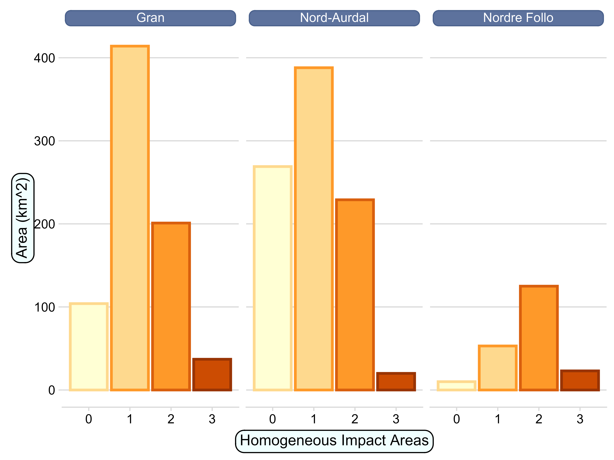

```{r setup}
#| include: false
#| eval: true
library(knitr)
library(targets)
library(tidyverse)
library(tarchetypes)
library(sf)
```

## Study location and HIAs

@fig-pos show the location of the three example municipalities included in this study.
Homogeneous impact area (HIA) were created by discretising the map in [@erikstad2023]
using the threshold values in @tbl-ranges.
Of the three municipalities, Nord Aurdal has the highest proportion of relatively 
undisturbed area (HIA equal to zero), and Nordre Follo has the highest proportion of
urban area (HIA class three) (@fig-muniHIAs).


| HIA class | Lower limit | Upper limit |
|-----------|-------------|-------------|
| 0         | 0           | \<1         |
| 1         | 1           | \<6         |
| 2         | 6           | \<12        |
| 3         | 12          | 15.44       |

: Data ranges used to categorise the Norwegian Land Use Intensity Index (the Infrastructure Index) [@erikstad2023] in the new categorical variable Homogeneous Impact Areas (HIA). {#tbl-ranges}


```{r fig-pos}
#| fig-cap: 'Position of the three municipalies analysed in this study.'
#| eval: true
positionMap <- tar_read(positionMap_png)
knitr::include_graphics(positionMap)
```

```{r fig-muniHIAs}
#| fig.cap: "Barplot showing the total area from each homogeneous impact area 
#| in three Norwegian municipalities"
#| out.width: '70%'
#| eval: true

```

## The targets workflow


The analyses are arranged into a pipeline, or targets workflow. The workflow file is called *\_targets.R,* and it relies on functions described in the file *R/functions.R*. All the code is available on GitHub at https://github.com/anders-kolstad/HIAs with an archived stable version on Zenodo (doi: ). When running the workflow, the individual targets (outputs from functions) gets stored in a folder locally. The manuscript, as well as this appendix document, is written in quarto. We can then read the targets back into R and print or visualise them, which is what we have done in this current document, and we leave the R code visible to be explicit about where in the targets workflow we are extracting information.

For example, @fig-c1 shows the target named *test_most_common*, which is a plot showing the most common wetland nature types in Norway.

```{r fig-c1}
#| eval: true
#| fig-cap: 'Ordered barplot showing the most common wetland nature types in Norway in terms of occurrence frequency.'
tar_read(test_most_common)
```

## Indicator development

The variable *7FA* was normalised into the indicator named Alien species; *7GR-GI* was normalised into the indicator Trenching; and *ADSV* was normalised and kept the name ADSV. Alien species was attributed to Ecosystem Condition Typology (ECT) class B1 - Compositional state characteristics and ADSV, and Trenching were attributed to ECT-class A1 - Physical state characteristics [@czucz_common_2021].

Common for all the variables was that they are originally recorded along binned frequency ranges [@norwegian_environmental_agency_protocol]. Because the data was strongly right skewed, we used the lower limit for each frequency range to convert them into percentages. @fig-c2 hows the distribution of variable values for the five variables extracted from the nature types dataset, after they have been converted to a percentage scale.


```{r fig-c2}
#| fig-cap: 'Distribution of variable values.'
#| eval: true
tar_read(test_naturetypes_p)
```

### Alien species

The variable *7FA* represents the abundance of alien species, mainly plants [@norwegian_environmental_agency_protocol].

### ADSV

Variables 7SE, PRSL, 7TK and PRTK describe very related aspects, and are attributed to the same ecosystem condition characteristic (vegetation intactness) and so they were combined into a single indicator called anthropogenic disturbance to soil and vegetation (ADSV).

The following snippet from the target *naturetypes_comb* shows how nature type polygons (rows) typically don't have all four of the variables underlying the ADSV indicator recorded. *7SE* and *PRSL* are combined into the variable *SE,* and *PRTK* and *7TH* are combined into the variable *TK.* Then the sum of *TK* and *SE* makes up the variable *ADSV.*

```{r c2x}
#| eval: true
tar_read("naturetypes_comb") |> head()
```

To combine these four variables into one metric, ADSV, one could take the one with the highest value (worst-rule), or the sum. Summation is problematic as not all locations have two values to sum together. But the other option is problematic since field workers often tend to split the effects over two variables, if they have that option, so that the summed variable values matches what they persieve as the correct answer. If we have 50% vehicle damage and 50% hiking damage, that is no doubt worse than having 50% of just one of them. So I will use the sum, despite its issues.

@fig-c3 shows the distribution of the two pairs of related variables after taking their sum, and @fig-c4 show the distribution after summing the two variables in @fig-c3.

```{r fig-c3}
#| fig-cap: 'Distribution of summed variable values for the two pairs of related variables 7SE/PRSL and 7TK/PRTK.'
#| eval: true
tar_read(plot_naturetypes_comb)
```

```{r fig-c4}
#| fig-cap: 'Distribution of summed ADVS variable values.'
#| eval: true
tar_read(plot_naturetypes_comb)
```

### Trenching

The variable *7GR-GI* is different from the preceding variables in that it includes an estimation of future effects that the observed trenches are projected to have on mire vegetation, function, or structure over time. This is not a favourable trait in a metric used to evaluate the ecosystem condition as it is today, yet we include it here nonetheless because there is a general shortage of data on mire hydrology, which is a fundamental part of mire integrity.

### Normalisation

@fig-c5 shows the normalisation of three variables into a dimentionaless indicator scale. The scaling functions are non-linear for ADSV and 7FA, ensuring that 0.6 on the indicator scale corresponds to the variable values that marks the threshold between good and reduced ecosystem condition.

For Alien species and ADSV, X~0~ and X~100~ was defined as 100% and 0%, respectively, whereas X~60~ was defined as 10%, thus making a piece-wise linear transformation (@fig-c5). For Trenching we defined X~0~ and X~100~ as 1 and 5, respectively, and X~60~ as 2.5. A variable value of 1 indicates an intact mire, and a value of 5 indicates a mire transitioning away from a wetland. A value of 2 indicates observable change within the range expected for the same mapping unit, and a value of 3 indicates a mire transitioning into a neighboring (ecologically speaking) mapping unit.


```{r fig-c5}
#| fig-cap: |
#|   "Scaling function for normalising the three condition variables.
#|    Custom re-scaling of variables to indicators. Unique threshold values are 
#|   assigned to each variable and this value is normalised to become 0.6 on the 
#|   indicator scale (y-axis). The variables also differ in the number of possible 
#|   values they can take, hence the varying number of points for the three panes."
#| eval: true
tar_read(plot_normalised)
```

## Indicator values

@fig-mag show how the indicator values are dispersed in Nord Aurdal municipality 
before they are extrapolated across to other mire occurrences in the municipality as in Figure 5.
@tbl-eea shows the same information about the indicator values as Figure 6, but in a table.

```{r fig-mag}
#| fig-cap: 'Map of Nord Aurdal municipalty with surveyed mires colored to show the indicator values.'
#| eval: true
#| out.width: '80%'
indicator_magnify_png <- tar_read(indicator_magnify_png)
knitr::include_graphics(indicator_magnify_png)
```

```{r tbl-eea}
#| tbl-cap: 'Indicator values and 95% credible intervals for three indicators in three municipalities.'
#| eval: true
knitr::include_graphics(here::here("output", "fig", "EEA_tbl_screenshot.png"))
```





# References {.unnumbered}

::: {#refs}
:::