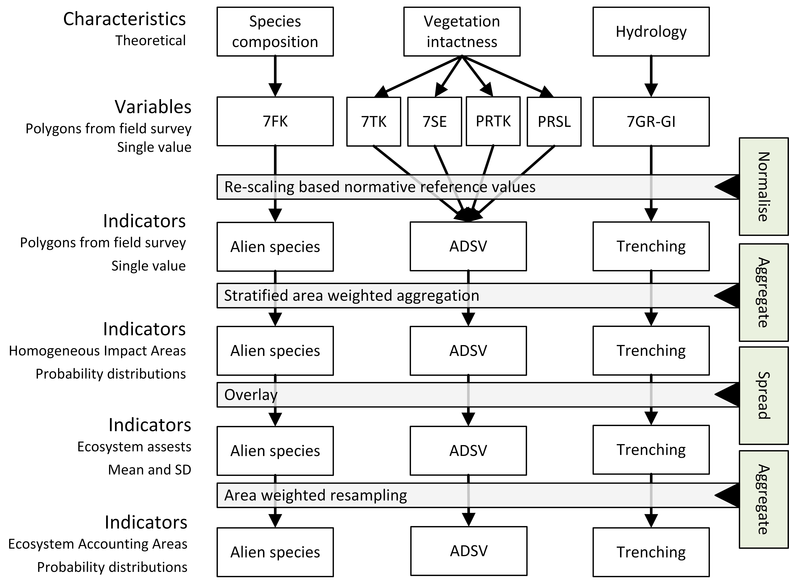

```{r setup, include=F, warning=F, message=F}
library(tidyverse)
library(knitr)
library(bookdown)
library(readr)
library(kableExtra)
options(knitr.table.format = "latex") 
```

# Introduction

Some general text about the decline in natural capital?

Ecosystem condition accounting is the game of compiling relevant data on the status, trends and qualities of ecosystems (i.e. nature) and communicating this in a structured format.
Its purpose is to make it easier to account for nature in policy by making the environmental costs of certain policies and practices visible to decision makers.
As natural capital keeps declining all over the world, it is becoming increasingly urgent to make the message clear to decision makers about A statistical standard for ecosystem accounting, including ecosystem condition accounting, was developed by the UN and adopted by the UN Statistical Commission in 2021 and is called SEEA EA (System of Environmental-Economic Accounting - Ecosystem Accounting).
The standard, or framework, is a set of rules, principles and best practices for compiling Ecosystem accounts, mainly aimed at national accounts.

Central to ecosystem condition accounts are variables and indicators.
These are parameters chosen to reflect the sentral condition characteristics of the ecosystems, and that can be quantified and ideally monitored over time to reflect the status and trends in condition.
Indicators are (data) variables that are normalised (rescaled) against upper and lower reference values to become bound between the values 0 and 1.
This normalisation ensures that indicators are more comparable because an indicator value of 1 will mean the same for all indicators, i.e. that the variable equals the upper reference value which again reflect the value of the variables under the reference condition.
Similarly, a value of 0 mean that the variable is the worst possible state.
The reference condition needs to be defined for each Ecosystem Condition Assessment separately, but SEEA EA gives some suggestion, such as an an ecosystem with no or minimal anthorpogenic disturbance.

A general requirement for indicators in the SEEA EA framework is that they should give an unbiased representation of the condition inside the ecosystem assets (Czucz et al 2021; Table 1 - validity; see also SEEA EA §2.87) Ecosystem assets are defined as "ecological entities [meaning areas] about which information is sought and about which statistics are ultimately compiled (REF). This requirement for indicator validity means that spatially biased data are ill suited, especially if sampling intensity varies along gradient of anthropogenic pressures and hence ecosystem condition. SEEA EA is spatially explicit, which in practice means that indicators that are in some way sampled (i.e. not complete wall-to-wall data like remotely sensed imagery), the values are projected on to areas on the map, so that all areas inside the ecosystem accounting area get assigned value for that indicator. There are at least 3 general ways to achieve this complete areal coverage of indicator values:

a.  Using wall-to-wall data (e.g. remotely sensed data)
b.  Predict values using a model (e.g. by accounting for environmental variation)
c.  Simple projection of some best estimate, typically a central tendency from area representative data

The need for an unbiased estimation of indicator values is unquestionable, but nonetheless, this requirement puts a large limitation on what types of data one can use.
Ecosystem condition assessments are generally limited by data availability, and the choice of variables and indicators to include in assessments are more often or not a pragmatic and opportunistic one which is unlikely to reflect the full scope of the ecosystem condition characteristics.
Note that the same is true for thematic biases.
For example reflected in the scarcity of data included on insects or soil biota, even though most will agree they represent key ecosystem characteristics.
Also having data from only one or a subset of nature types inside what is defined as the ecosystem in the assessment, is a typical thematic bias in ecosystem accounting.
However, in this paper we chose to focus on spatial bias.

Being able to make use of spatially biased data would greatly alleviate data shortage problems in ecosystem condition accounts.
One way to achieve this is modelling (option b in the list above).
Models can describe the general associations between the spatially sampled data and the context (e.g. the set of environmental variables) where it was samples, and use these arelationships to predict and project indicator values to areas that where not originally sampled.
Depending on the data that goes into these models, they can be very reliable and make good indicators.
This is especially true when the ecosystem assets are large (e.g. regions or nations).
But when they are small, like the scale of a municipality, and when the indicator is more likely to be used as the evidence base in concrete physical land use planning, then the inherent lvel of uncertainty from such models becomes unacceptable.

In this study we explore the potential for using a stratified aggregation technique to make use of spatially biased field data in ecosystem condition accounting.
We demonstrate this technique using a generic GIS-based workflow for compiling ecosystem condition accounts that can be applied at any spatial scale, and we highlight the opportunities for local use-cases of this workflow by contrasting our findings across four neighboring municipalities in Norway.
The main question is how much generalisation can we perform on the data we have before the resulting indicator looses its practical value in local governance processes.
We end by interviewing end-users from the relevant municipalities about the perceived benefits and shortcomings of our condition indicators.

# Material and Methods

In this study we focused on open mire ecosystems in Norway.
For this ecosystem we have an ecosystem delineation map produced using remotely sensed data and a deep learning model (REF Bakkestuen).
This model, which has a 90.9% precision when tested against independent field data, estimates 12.7% of the area in southern Norway is mire (Bakkestuen REF).
Mires are ecologically and socially important in Norway simply do to its large extent, and due to its role in climate mitigation, as mires store a large amount of carbon (REF?).
There has not been a national assessment of the ecosystem condition of mires in Norway, but we recent contributed on a report which presented several new indicators that can be used in future assessment (REF Nybø, and web site).
This study builds on the work in that report.

We started by defining the reference state as one where ecosystems are subject to little or no human influence, with a climate as in the period 1961-1990 and a native species pool similar as today (i.e no mammoths allowed).
We then identified two *ecosystem condition characteristics* that, along with many other characteristics that we do not specify here, define the typical behavior of open mire ecosystems in the reference condition: species composition, and; vegetation intactness.

To describe these two concepts we use five condition variables from the same data set (see \@(tab:foo)).

| Variable code        | Variable name                                    | Measurement unit                                                                        | Description                                                                                                    | Reference  |
|---------------|---------------|---------------|---------------|---------------|
| 7FK                  | Prevalence of alien species                      | Unitless, ordinal, non-linear scale from 1 (no alien species) to 7 (only alien species) | The fraction of the species composition made up from alien species                                             | Halvorsen  |
| 7SE                  | Human caused abration or abration-caused erosion | Unitless, ordinal, non-linear scale from 1 to 4.                                        | Measures the frequency of imagined 4 m^2^ quadrats layed over the area that has some sign of abration          | ref        |
| PRSL                 | *as above*                                       | Unitless, ordinal, non-linear scale from 0 to 7.                                        | Same as 7SE, but recorded at a higher resolution                                                               | Mdir       |
| 7TK                  | Tracks from large vehicles                       | Unitless, ordinal, non-linear scale from 1 to 4.                                        | Measures the frequency of imagined 100 m^2^ quadrats layed over the area that has some signs of vehicle tracks | Halvorsen  |
| PRTK                 | *as above*                                       | Unitless, ordinal, non-linear scale from 0 to 7.                                        | Same as 7TK, but recorded at a higher resolution                                                               | Mdir       |
| Infrastructure Index | Infrastructure Index                             | Unitelss linear scale from 0 to 13.2                                                    | Unitelss index ranging from from 0 to 13.2                                                                     | Erikstad   |
| HIA                  | Human Impact area                                | Ordinal, non-linear scale from 1 to 4                                                   | A categorical representation of the infrastructure index                                                       | this paper |

Table: (\#tab:foo) Variables used in this study

Reference to Figure \@(fig:cars-plot)

```{r cars-plot, fig.cap="Test caption"}
plot(cars)
```


The data set is from a standardised field survey of nature types in Norway that started in 2018 and which is still ongoing (REF).
We included data fram 2018 to 2023.
In this survey, selected nature types are delineatied on a map, and each locality is scored on a range of variables relevant for describing the state and quality of nature.
The surveys are commissioned with the goal of producing data relevant for immediate land-use decisions, and is therefore spatially biased, typically towards areas with high human impact or expected impact.
In addition there is a thematic and size bias in the sampling protocol.
Of all possible mire types, the survey only maps the following:

-   Southern ombrotrophic mires \> 2500 m^2^

-   Northern omgrotrophic \> 10.000 m^2^

-   All semi-natural mires (minerotrophic)

-   Calcareous southern fens \>500 m^2^

-   Calcareous northen fens \>1000 m^2^

In the above, *southern* refers to boreonemoral and southboreal zones, and *northern* refers to mid-boreal, north boreal, and alpine zones.
In addition, the northern fens need to be even more calcareous than the southern fens in order to be surveyed.
In this paper we assume the survey is representative for the entire mire ecosystem in Norway.
Although it is possible that smaller or less calcareous mires will score systematically different than the ones that are surveyed we do not think this is the case for our variables at least.

7FK was developed into a single indicator (i.e. a normalised variable) named *Alien plant cover*.
Variables 2-5 describe very related aspects as so they where planned to be combined into one indicator called antropogenic disturbance to soil and vegetation, or ADSV for short.
This was done by taking the value from the variable with the lowest value, i.e. worst condition.
For both indicators, the lower and upper reference values, i.e. the worst and best possible condition that the variables can be in, is given by the range of the data where 0 or 1 is the lower limit and 4, 7 or 8 is the upper limit, depending on the variable (see @tbl-variables).

The Alien plant cover was assigned to ECT class B1 - Compositional state characteristics and ADSV was assigned to ECT class A1 - Physical state characteristics (REF).



We chose three municipalities in Norway to test out the indicator (FIG).
These municipalities are spread over xxx km north to south, and also differ in the amount of mire area, the total area surveyed, and the prevalence of infrastructure (TABLE)

To

Validation/sensitivity analyses (varying HIA resolution and minimum *n*?)

Schematic GIS workflow

Aggregation

# Results

Data availability/coverage

Validation

National/regional indicator - do we have enough data?

Municipal case study

# Discussion

# Conclusion

# Credit authorship contribution statement {.unnumbered}

# Declaration of Competing Interest {.unnumbered}

# Acknowledgements {.unnumbered}

# Data availability {.unnumbered}

# References {.unnumbered}
