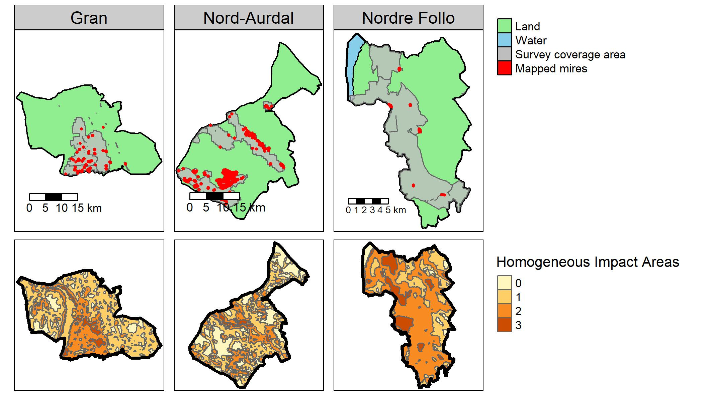
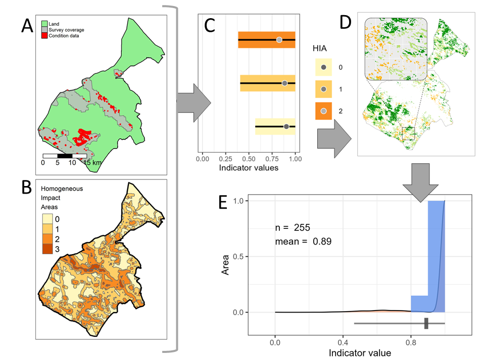
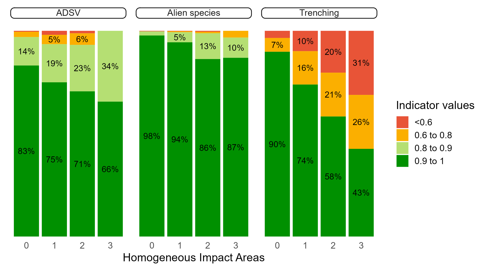
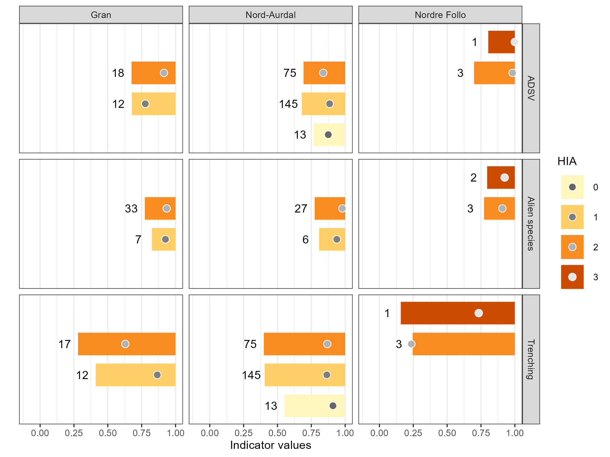
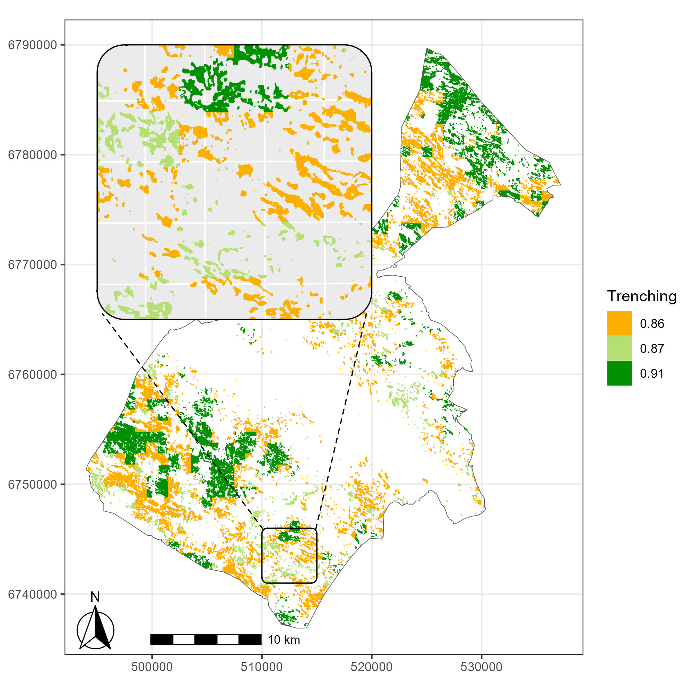
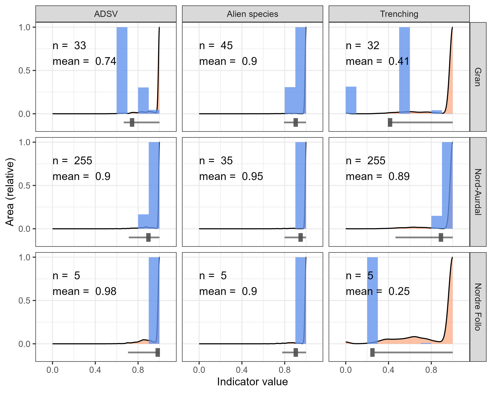

```{r setup}
#| eval: true
library(conflicted)
conflict_prefer_all("dplyr", quiet =T)

library(knitr)
library(sf)
library(tmap)
library(tmaptools)
library(stars)
library(terra)
library(tidyterra)
library(ggtext)
library(cowplot)
library(units)
library(rnaturalearth)
library(rnaturalearthdata)
library(ggmagnify)
library(ggridges)
library(eaTools) #https://ninanor.github.io/eaTools/ version 0.0.0.9000
library(ggpubr)
library(kableExtra)
library(here)
library(MASS)
library(ggh4x)
library(tidyverse)
myCRS <- 25832
```

```{r paths}
#| eval: true

source(here::here("helpers.R"))
root <- get_root_NINA()
rootR <- get_root_NINA("R")

# Some directories

# Ecosystem delineation map - unfortunately to publicly available
path_mire <- paste0(root, "41201785_okologisk_tilstand_2022_2023/data/Myrmodell/myrmodell90pros.tif")

# infrastructure index (i.e. land use intensity index)
path_infrastructure <- paste0(rootR, "GeoSpatialData/Utility_governmentalServices/Norway_Infrastructure_Index/Original/Infrastrukturindeks_UTM33/infra_tiff.tif")

# field survey
# # downloaded from https://kartkatalog.geonorge.no/metadata/naturtyper-miljoedirektoratets-instruks/eb48dd19-03da-41e1-afd9-7ebc3079265c
path_naturetypes <- paste0(root, "41001581_egenutvikling_anders_kolstad/data/Naturtyper_nin_0000_norge_25833_FILEGDB.gdb")

# municipality outline
path_muni <- here::here("data/Basisdata_0000_Norge_25833_Kommuner_FGDB.gdb")

# path to local caching folder
path_temp <- paste0(root, "41201785_okologisk_tilstand_2022_2023/data/cache/")
```

```{r import}
#| eval: true
#| cache: true

# I already did some work to identify the relevant nature types
# summary file (https://github.com/NINAnor/ecosystemCondition/blob/main/data/naturetypes/natureType_summary.rds)
naturetypes_summary <- readRDS(here("data/natureType_summary.rds"))

# Survey data
# The data is too big to be stored on GitHub
# Import polygon data set

# Getting the layer names
# st_layers(path_naturetypes) 

# Set local to ensure Norwegian letters get imported correctly. I have this ilne in my Rprofile:
# Sys.setlocale("LC_ALL", "nb_NO.UTF-8") 


naturetypes <- sf::st_read(dsn = path_naturetypes, layer = "naturtyper_nin_omr",
                           quiet= T)
# 142k polygons (2023)

# Import survey coverage map
coverage <- sf::st_read(dsn = path_naturetypes, layer = "naturtyper_nin_dekning",
                        quiet= T) |>
  st_transform(myCRS)

# Outline of norway (coastline)
outline <- sf::read_sf(here("data/outlineOfNorway_EPSG25833.shp"),
                       quiet= T) |>
  st_transform(myCRS)

# Municipalities
# find the correct layer
  # st_layers(path_muni)

# read inn data and transform
muni <- sf::read_sf(path_muni, layer = "kommune",
                    quiet= T) |>
  st_transform(myCRS)

# Infrastructure index (read proxy)
infra <- stars::read_stars(path_infrastructure)

```

```{r terraLoad}
#| eval: true
# Import mire delineation data
# Spat rasters cannot be cached
mire_terra <- terra::rast(path_mire)
```

```{r getRelevantNTs}
#| eval: true

# Getting the names of the relevant nature types (mapping units)

# These are the variables we're after
myVars <- c("7TK", "7SE", "PRTK", "PRSL", "7FA", "7GR-GI")

# And these are the mapping units that have them
nts <- naturetypes_summary %>%
  rowwise() %>%
  mutate(keepers = sum(c_across(
    all_of(myVars))>0, na.rm=T)) |>
  filter(
    keepers >0,
    Ecosystem == "våtmark"
    ) |>
  pull(Nature_type)
nts
```

```{r natureTypeData}
#| eval: true
#| cache: true

# Clean and subset the survey data

naturetypes <- naturetypes |>
  # keep only wetlands
  filter(
    hovedøkosystem == "våtmark",
    naturtype %in% nts,
    naturtype != "Kalkrik helofyttsump"
  ) |>
  # calculate the areas (m2) of the polygons
  mutate(area = SHAPE |> st_area()) |>
  # the variable codes and values are all in the same column
  separate_rows(ninBeskrivelsesvariable, sep = ",") |>
  separate(
    col = ninBeskrivelsesvariable,
    into = c("NiN_variable_code", "NiN_variable_value"),
    sep = "_",
    remove = F
  ) |>
  mutate(NiN_variable_value = as.numeric(NiN_variable_value)) |>
  filter(NiN_variable_code %in% myVars) |>
  select(
    id = identifikasjon_lokalId,
    municipality = kommunenummer,
    year = kartleggingsår,
    mosaic = mosaikk,
    quality = lokalitetskvalitet,
    biodiversity = naturmangfold,
    condition = tilstand,
    natureType = naturtype,
    variable = NiN_variable_code,
    value = NiN_variable_value,
    area
  ) |>
  st_transform(myCRS) # Choosing this to match the EDM (se further down)
# 26k obs.
```

```{r}
#| eval: false
# Plot to show what the most common nature types in the data set are
naturetypes |>
  as_tibble() |>
  count(natureType, sort=T) |>
  mutate(natureType = fct_reorder(natureType, n)) |>
  ggplot(aes(x = natureType, y = n))+
  geom_col()+
  coord_flip()
```

```{r convertToPercent}
#| eval: true
# I now want to take the variables and normalise them before I can then combine
# them despite them being on different scales.
# I will first normalise by converting into % (not for 7GR-GI).
# Remember the ordinal categories represents frequency ranges
# The data is strongly right skewed, so simply taking the center value of each
# bin will not work

# I will use the lower bound for each bin instead.
# The exception in when the variable is 1, because then the lower bound
# is 0, same as when the variable is 0.
# For these I will set manually a slightly higher value.

naturetypes <- naturetypes %>%
  mutate(value = case_when(
    # selecting the variables that follow the same 4 step scale
    variable %in% c("7TK", "7SE", "7FA") ~
      case_match(
        value,
        0 ~ 0,
        1 ~ mean(c(0, 1 / 16)) * 100,
        2 ~ 1 / 16 * 100,
        3 ~ 50
      ), # note that it is not possible to get a value of 1
    # selecting the eight step variables
    variable %in% c("PRTK", "PRSL") ~
      case_match(
        value,
        0 ~ 0,
        1 ~ 1.5,
        2 ~ 3,
        3 ~ 6.25,
        4 ~ 12.5,
        5 ~ 25,
        6 ~ 50,
        7 ~ 75
      ),
    .default = value
  ))

naturetypes %>%
  filter(variable != "7GR-GI") |>
  ggplot() +
  theme_bw() +
  geom_histogram(aes(x = value),
    binwidth = 1,
    color = "orange",
    fill = "orange"
  ) +
  xlab("%") +
  facet_wrap(. ~ variable,
    scales = "free"
  )

```

```{r}
#| eval: true
# Now I make the data wide, and remove 7TK and 7SE if PRTK or PRSL are present,
# respectively

naturetypes_wide <- naturetypes |>
  filter(variable %in% c("7TK", "7SE", "PRTK", "PRSL")) |>
  # Column names starting with a number is problematic, so adding a prefix
  mutate(variable = paste0("var_", variable)) |>
  pivot_wider(
    names_from = "variable",
    values_from = "value",
    id_cols = "id") |>
    as_tibble()

head(naturetypes_wide, 10)
```

```{r}
#| eval: true
# First I will combine 7TK and PRTK, and also 7SE and PRSL.
naturetypes_wide <- naturetypes_wide %>%
  mutate(
    TK = if_else(
      is.na(var_PRTK), var_7TK, var_PRTK
    ),
    SE = if_else(
      is.na(var_PRSL), var_7SE, var_PRSL
    )
  )

plot_grid(
  naturetypes_wide %>%
    as_tibble() |>
    count(SE,
      name = "sum"
    ) |>
    ggplot(
      aes(
        x = factor(SE),
        y = sum
      )
    ) +
    geom_bar(
      stat = "identity",
      fill = "grey",
      colour = "black"
    ) +
    theme_bw(base_size = 12) +
    labs(
      x = "7SE or PRSL score",
      y = "Number of localities"
    ),
  naturetypes_wide %>%
    as_tibble() |>
    count(TK,
      name = "sum"
    ) |>
    ggplot(
      aes(
        x = factor(TK),
        y = sum
      )
    ) +
    geom_bar(
      stat = "identity",
      fill = "grey",
      colour = "black"
    ) +
    theme_bw(base_size = 12) +
    labs(
      x = "7TK or PRTK score",
      y = "Number of localities"
    )
)

# The NA's represents localities where just one of the two variables
# (then thinking 7SE and PRSL as the same variable)
# is recorded. 

# To combine these into one metric, ADSV, I could take the
# one with the highest value (worst-rule) or the sum.
# Sum is problematic as not all locations have two values to sum together.
# But the other option is problematic since I think field workers often
# tend to split the effects over two variables is they have that option.
# And if we have 50% vehicle damage and 50% hiking damage, that is no doubt
# worst than just having 50% of either. So I will use the sum, despite its issues.
```

```{r}
#| eval: true
# Taking the sum of 7SE and 7TK (incl the PR.. variables)
naturetypes_wide <- naturetypes_wide |>
  rowwise() |>
  mutate(ADSV = sum(c(SE, TK), na.rm = TRUE))

naturetypes_wide %>%
  as_tibble() |>
  count(ADSV,
    name = "sum"
  ) |>
  ggplot(
    aes(
      x = ADSV,
      y = sum
    )
  ) +
  geom_bar(
    stat = "identity",
    fill = "grey",
    colour = "black"
  ) +
  theme_bw(base_size = 12) +
  labs(
    x = "Summed ADVS score",
    y = "Number of localities"
  ) +
  scale_x_continuous(
    labels = scales::label_number(accuracy = 1)
  )

```

```{r}
#| eval: true

# Now I will copy these ADVS-values into the sf object again, keeping things in wide format
naturetypes <- naturetypes |>
  pivot_wider(
    names_from = "variable",
    values_from = "value"
  ) |>
  left_join(naturetypes_wide |> select(id, ADSV), by = "id") |>
  select(!c("7TK", "7SE", "PRSL", "PRTK"))

head(naturetypes)
```

```{r rescale}
#| eval: true

# Now I normalise the now continuous variables using reference levels
# I will use the same reference levels for all of Norway for ADSV and alien species:
# upper is x100, lower is X0 and threshold is x60.

upper <- 0
lower <- 100
threshold <- 10

# For 7GR-GI I use this
upper2 <- 1
lower2 <- 5
threshold2 <- 2.5 # = observable effect. Value 3 indicates a shift to a new type (grunntype)


scale1 <- eaTools::ea_normalise(data = naturetypes,
  vector = "ADSV",
  upper_reference_level = lower,
  lower_reference_level = upper,
  break_point = threshold,
  plot=T,
  reverse = T
  ) +
  labs(x = "ADVS (converted to %)") +
  ylim(0,1)

# There is no point yet making this a time series
# I will assign all the indicator value to the same time (2018-2022)

# same for 7FA
scale2 <- eaTools::ea_normalise(data = naturetypes,
  vector = "7FA",
  upper_reference_level = lower,
  lower_reference_level = upper,
  break_point = threshold,
  plot=T,
  reverse = T
  ) +
  labs(x = "7FA (converted to %)",
       y = "") +
  ylim(0,1)
# The variables are really coarse

scale3 <- eaTools::ea_normalise(data = naturetypes,
  vector = "7GR-GI",
  upper_reference_level = lower2,
  lower_reference_level = upper2,
  break_point = threshold2,
  plot=T,
  reverse = T
  )+
  labs(x = "7GR-GI (original units)",
       y = "") +
  ylim(0,1)

(scaling_plot <- ggarrange(scale1,
          scale2,
          scale3,
          ncol=3)
)

#ggsave(plot = scaling_plot,
#  "../images/scaling-plot.jpg",
#  width=8,
#  height=5)
```

```{r}
#| eval: true
# Adding scaled indicator values to the dataset
# Same code as above, but with plot=F.
naturetypes$i_ADSV <- eaTools::ea_normalise(
  data = naturetypes,
  vector = "ADSV",
  upper_reference_level = lower,
  lower_reference_level = upper,
  break_point = threshold,
  reverse = T
)

naturetypes$i_alien <- eaTools::ea_normalise(
  data = naturetypes,
  vector = "7FA",
  upper_reference_level = lower,
  lower_reference_level = upper,
  break_point = threshold,
  reverse = T
)

naturetypes$i_ditch <- eaTools::ea_normalise(
  data = naturetypes,
  vector = "7GR-GI",
  upper_reference_level = lower2,
  lower_reference_level = upper2,
  break_point = threshold2,
  reverse = T
)
```

```{r getMunicipalities}
#| eval: true

# Preparing the outlines for the three municipalieties

# The data contains some multisurfaces 
# table(st_geometry_type(muni))
# Here is a function to make sure that multipolygons are returned
ensure_multipolygons <- function(X) {
  tmp1 <- tempfile(fileext = ".gpkg")
  tmp2 <- tempfile(fileext = ".gpkg")
  st_write(X, tmp1)
  gdalUtilities::ogr2ogr(tmp1, tmp2, f = "GPKG", nlt = "MULTIPOLYGON")
  Y <- st_read(tmp2)
  st_sf(st_drop_geometry(X), geom = st_geometry(Y))
}

muni <- ensure_multipolygons(muni)
# table(st_geometry_type(muni)) #OK

# subset of the three target municipalities
muni3 <- muni |>
  filter(kommunenummer %in% c(
    "3207", # Nordre Follo
    "3451", # Nord-Aurdal
    "3446" # Gran
  )) |>
  mutate(Municipality = case_when(
    kommunenummer == "3207" ~ "Nordre Follo",
    kommunenummer == "3451" ~ "Nord-Aurdal",
    kommunenummer == "3446" ~ "Gran"
  ))

# To crop the EDM, I need the three municipalities separately.
nf <- muni3 |>
  filter(kommunenummer == "3207")
na <- muni3 |>
  filter(kommunenummer == "3451")
gr <- muni3 |>
  filter(kommunenummer == "3446")
```

```{r prepPolygons}
#| eval: true

# I need to intersect the naturetypes data with the municipalities
nature3 <- naturetypes |>
  st_intersection(muni3)

nature3 |>
  as_tibble() |>
  count(municipality,
    sort = TRUE,
    name = "Number of polygons")
# There where some polygons that spanned municipal borders. 
# It's not a problem

# and also to get the data coverage polygon.
coverage3 <- coverage |>
  st_intersection(muni3)
```

```{r prepSomeMoreMunicipalityShapes}
#| eval: true

# Simplified coastline / terrestrial area
terrestrial <- outline |>
  st_intersection(muni3)

# Polygons for the oceans in each municipality
ocean <- muni3 |>
  st_difference(outline)

# calculate stats - terrestrial area
terrestrial <- terrestrial |>
  mutate(
    area_t = geometry |> st_area(),
    t_area_km =
      round(units::drop_units(area_t * 1e-6))
  ) 
```

```{r positionMap}
#| eval: true
# Make map to show where the three municipalities are
world <- ne_countries(scale = "medium", returnclass = "sf") |>
  st_transform(myCRS) |>
  filter(admin %in% c("Norway", "Sweden")) |>
  st_make_valid()

# get centroids
centroids <- muni3 |>
  st_centroid()

inc <- 200000
myBbox <- st_bbox(centroids)
myBbox[1:2] <- myBbox[1:2]-inc 
myBbox[3:4] <- myBbox[3:4]+inc 

(positionMap <- 
  tm_shape(world,
           bbox = myBbox) +
    tm_polygons() +
  tm_shape(muni3) +
    tm_polygons(col = "green") +
  tm_shape(centroids) +
  tm_text(
    text = "Municipality",
    just= "left",
    size = .8,
    xmod = 1,
    ymod = 0
  ) +
  tm_grid(projection = 4326) +
  tm_layout(
    bg.color = "skyblue",
    outer.margins = c(0.01, .02, .02, .02))+
  tm_compass()+
  tm_scale_bar()
)

# tmap_save(tm = positionMap,
#        "../images/positionMap.jpg")
```

```{r distanceBetweenMunis}
#| eval: true

# what is the distance between Nordre Follo and Nord-Aurdal
(km_distance <- centroids |>
  st_distance() |>
  max() |>
  set_units("km") |>
  drop_units() |>
  round())
```

```{r mireTerra}
#| eval: false
# This code block is set to eval: False and manually cached in a gitignored folder.

# I first tried to import and crop the mire data using stars, 
# but that failed (see pre 21 feb 2023).
# Trying { terra } instead

# convert municipal outline to vect via st
nf_vect <- as(nf, "Spatial") |>
  terra::vect()
gr_vect <- as(gr, "Spatial") |>
  terra::vect()
na_vect <- as(na, "Spatial") |>
  terra::vect()

# crop and mask (very fast!)
mire_terra_nf <- mire_terra |>
  terra::crop(nf_vect) |>
  terra::mask(nf_vect)

mire_terra_gr <- mire_terra |>
  terra::crop(gr_vect) |>
  terra::mask(gr_vect)

mire_terra_na <- mire_terra |>
  terra::crop(na_vect) |>
  terra::mask(na_vect)

# Plot to check overlap
# ggplot()+
#  geom_spatraster(data = mire_nf_terra)+
#  geom_spatvector(data = nf_vect,
#                  fill = NA)
# The cropping and masking worked.

# # I like the stars, sf and tmap combo better, so I return to stars
mire_stars_nf <- mire_terra_nf |>
  st_as_stars()
mire_stars_gr <- mire_terra_gr |>
  st_as_stars()
mire_stars_na <- mire_terra_na |>
  st_as_stars()

par(mfrow=c(3,1))
plot(mire_stars_nf)
plot(mire_stars_gr)
plot(mire_stars_na)

saveRDS(mire_stars_nf, "manual_cache/mire_stars_nf.RDS")
saveRDS(mire_stars_gr, "manual_cache/mire_stars_gr.RDS")
saveRDS(mire_stars_na, "manual_cache/mire_stars_na.RDS")

```

```{r terraToSTars}
#| eval: true
manu <- here::here("manuscript")
mire_stars_nf <- readRDS(here::here("manuscript", "manual_cache/mire_stars_nf.RDS"))
mire_stars_gr <- readRDS(here::here("manuscript", "manual_cache/mire_stars_gr.RDS"))
mire_stars_na <- readRDS(here::here("manuscript", "manual_cache/mire_stars_na.RDS"))
mire_terra_nf <- rast(mire_stars_nf)
mire_terra_gr <- rast(mire_stars_gr)
mire_terra_na <- rast(mire_stars_na)
```

```{r dk2-CoverageMaps}
#| eval: true
#| cache: true

# calculate area of survey coverage maps
# values goes into summary table in the ms
dk2 <- coverage3 |>
  group_by(Municipality) |>
  summarise(SHAPE = st_union(SHAPE)) |>
  mutate(
    dk_area_km = SHAPE |> st_area(),
    dk_area_km = round(units::drop_units(dk_area_km * 1e-6))
  )
```

```{r mireArea}
#| eval: true
#| cache: true

# calculate area of the mires in each municipality
# -- Nordre Follo
(mireArea <- mire_terra_nf |>
  global(c("mean", "sum"), na.rm = T) |>
  add_column("Municipality" = "Nordre Follo") |>
  mutate(
    mirePercent = round(mean * 100, 1),
    mire_km2 = sum / 1e+4
  ))

# -- Gran
mireArea2 <- mire_terra_gr |>
  global(c("mean", "sum"), na.rm = T) |>
  add_column("Municipality" = "Gran") |>
  mutate(
    mirePercent = round(mean * 100, 1),
    mire_km2 = sum / 1e+4
  )

# -- Nord-Aurdal
mireArea3 <- mire_terra_na |>
  global(c("mean", "sum"), na.rm = T) |>
  add_column("Municipality" = "Nord-Aurdal") |>
  mutate(
    mirePercent = round(mean * 100, 1),
    mire_km2 = sum / 1e+4
  )

mireArea <- mireArea |>
  rbind(mireArea2, mireArea3)

# Calculate the area of mire inside the coverage maps
# -- Nordre Follo
mire_in_dk <- mire_terra_nf |>
  terra::mask(dk2 |> filter(Municipality == "Nordre Follo")) |>
  global("sum", na.rm = T) |>
  mutate(mireInSurvey_km2 = sum / 1e+4) |>
  add_column(Municipality = "Nordre Follo")

mire_in_dk2 <- mire_terra_gr |>
  terra::mask(dk2 |> filter(Municipality == "Gran")) |>
  global("sum", na.rm = T) |>
  mutate(mireInSurvey_km2 = sum / 1e+4) |>
  add_column(Municipality = "Gran")
mire_in_dk3 <- mire_terra_na |>
  terra::mask(dk2 |> filter(Municipality == "Nord-Aurdal")) |>
  global("sum", na.rm = T) |>
  mutate(mireInSurvey_km2 = sum / 1e+4) |>
  add_column(Municipality = "Nord-Aurdal")

mire_in_dk <- mire_in_dk |>
  rbind(mire_in_dk2, mire_in_dk3)
```

```{r infrastructureIndex}
#| eval: false
# This code block is also eval: false and cached manually

# this data is on a 100x100m grid
infra <- infra |>
  # , which is more then we need - warp it to 1x1km
  st_warp(
    cellsize = c(1000, 1000),
    crs = st_crs(nf),
    use_gdal = TRUE,
    method = "average"
  ) |>
  setNames("infrastructureIndex") |>
  st_transform(myCRS) |>
  mutate(infrastructureIndex = case_when(
    infrastructureIndex < 1 ~ 0,
    infrastructureIndex < 6 ~ 1,
    infrastructureIndex < 12 ~ 2,
    infrastructureIndex >= 12 ~ 3
  )) |>
  # taking away point in the sea
  st_crop(outline)

# This step might seem rather stupid. We want to vectorize a rather large 
# raster. This makes it a quite big data object. The reason is that there is no 
# really good way to burn polygon data on to raster grid cells after the disuse 
# of the raster package. It was not straight forward then either. But 
# calculating intersections between polygons is very fast and easy.

infra <- eaTools::ea_homogeneous_area(infra,
  groups = infrastructureIndex
)

#saveRDS(infra, paste0(path_temp, "infrastructureIndex_discrete_vectorized.rds"))
```

```{r InfraStructureIndex2}
#| eval: true

# read cached vetorized infrastructure data
infra <- readRDS(paste0(path_temp, "infrastructureIndex_discrete_vectorized.rds"))

```

```{r}
#| eval: true

# Calculate area
infra <- infra |>
  mutate(
    area = geometry |> st_area(),
    area_km = area |> set_units("km2")
  )

# show the summered area per HIA
infra |>
  as_tibble() |>
  group_by(infrastructureIndex) |>
  summarise(area_km = units::drop_units(sum(area_km))) |> 
  ggplot(aes(
    x = infrastructureIndex,
    y = area_km
  )) +
  geom_col()


# intersect with the three municipalities
# and calculate area
infraMuni3 <- infra |>
  st_intersection(muni3) |>
  mutate(area = geometry |> st_area())

# Turn m2 into km2
# and sum the total area per HIA
(infraMuni3_tbl <- infraMuni3 |>
  as.data.frame() |>
  mutate(area_HIA_km2 = units::drop_units(area) * 1e-6) |>
  group_by(Municipality, infrastructureIndex) |>
  summarise(total_area_HIAs_km2 = round(sum(area_HIA_km2))))

# Calculate the area weighted mean HIA value per municipality
infraMuni3_summary <- infraMuni3_tbl |>
  group_by(Municipality) |>
  summarise(
    meanHIA =
      round(
        weighted.mean(
          infrastructureIndex, total_area_HIAs_km2
        ), 2
      )
  )

# Make a plot to check that it has worked
(infra_dist_plot <- infraMuni3_tbl |>
  ggplot() +
  geom_bar(
    aes(
      x = infrastructureIndex,
      y = total_area_HIAs_km2,
      fill = factor(infrastructureIndex),
      colour = factor(infrastructureIndex)
    ),
    stat = "identity",
    lwd = 1.2
  ) +
  scale_fill_manual(values = RColorBrewer::brewer.pal(4, "YlOrBr")) +
  scale_color_manual(values = RColorBrewer::brewer.pal(5, "YlOrBr")[-1]) +
  theme_minimal_hgrid() +
  labs(
    x = "Homogeneous Impact Areas",
    y = "Area (km<sup>2</sup>)"
  ) +
  theme(
    axis.title.x = element_textbox_simple(
      width = NULL,
      padding = margin(4, 4, 4, 4),
      margin = margin(4, 0, 0, 0),
      linetype = 1,
      r = grid::unit(8, "pt"),
      fill = "azure1"
    ),
    axis.title.y = element_textbox_simple(
      width = NULL,
      padding = margin(4, 4, 4, 4),
      margin = margin(4, 0, 0, 0),
      linetype = 1,
      orientation = "left-rotated",
      r = grid::unit(8, "pt"),
      fill = "azure1"
    ),
    strip.background = element_blank(),
    strip.text = element_textbox(
      size = 12,
      color = "white", fill = "#5D729D", box.color = "#4A618C",
      halign = 0.5, linetype = 1, r = unit(5, "pt"), width = unit(1, "npc"),
      padding = margin(2, 0, 1, 0), margin = margin(3, 3, 3, 3)
    )
  ) +
  guides(fill = "none", colour = "none") +
  #scale_y_log10() +
  facet_grid(cols = vars(Municipality))
)

#ggsave(plot = infra_dist_plot,
#       "../images/infra-dist-plot.jpg")
```

```{r corrCheck}
#| eval: true
#| cache: true
# Now I want to see if the indicator values depend on the HIA in a predictable
# way to justify the stratification
corrCheck <- st_intersection(naturetypes, infra)
```

```{r HIA-validate}
#| eval: false
# A first look
corrCheck |>
  mutate(
    i_ADSV_fct = floor(round(i_ADSV * 10, 2)) / 10,
    i_alien_fct = floor(round(i_alien * 10, 2)) / 10,
    i_ditch_fct = floor(round(i_ditch * 10, 2)) / 10
  ) |>
  pivot_longer(
    cols = c(i_ADSV_fct, i_alien_fct, i_ditch_fct),
    values_to = "indicatorValue",
    names_to = "indicator",
    values_drop_na = T
  ) |>
  ggplot(aes(
    x = factor(infrastructureIndex),
    fill = factor(indicatorValue)
  )) +
  geom_bar(
    position = "fill"
  ) +
  theme_bw(base_size = 12) +
  guides(fill = guide_legend("Scaled indicator values")) +
  ylab("Fraction of data points") +
  xlab("HIA") +
  scale_fill_brewer(palette = "RdYlGn") +
  facet_grid(indicator ~ year)

# After this I also tried changing the color gradient, 
# and the number of categories. I tries discrete colors and log-transformation.
# These variants are interpreted slightly differetly by the brain.
# See versions pre 27.02.2023
```

```{r realValidationPlot}
#| eval: true
# Using a color gradient emphasizes the first color (dark green).
# Lets try discrete colors, and merge some classes to simplify
(validationPlot <- corrCheck |>
  pivot_longer(
    cols = c(i_ADSV, i_alien, i_ditch),
    values_to = "indicatorValue",
    names_to = "indicator",
    values_drop_na = T
  ) |>
  mutate(
    condition = case_when(
      indicatorValue < 0.6 ~ "<0.6",
      indicatorValue < 0.8 ~ "0.6 to 0.8",
      indicatorValue < 0.91 ~ "0.8 to 0.9",
      .default = "0.9 to 1"
    ),
    condition = fct_reorder(condition, indicatorValue),
    indicator = case_when(
      indicator == "i_ADSV" ~ "ADSV",
      indicator == "i_alien" ~ "Alien species",
      indicator == "i_ditch" ~ "Trenching"
    )
  ) |>
  as_tibble() |>
  group_by(indicator, infrastructureIndex, condition) |>
  summarise(n = n()) |>
  ungroup() |>
  group_by(indicator, infrastructureIndex) |>
  mutate(lab = round(n/sum(n)*100),
         lab = case_when(
           lab < 5 ~ NA,
           .default = paste0(lab, "%")
         )) |>
  ggplot(aes(
    x = infrastructureIndex,
    y = n,
    fill = condition
  )) +
  geom_bar(
    position = "fill",
    stat = "identity"
  ) +
  geom_text(aes(label = lab),
    position = position_fill(vjust = 0.5),
    color= "black", vjust = 0.5, size = 4) +
  theme_minimal(base_size = 15) +
  theme(
    panel.grid = element_blank(), 
    axis.text.x = element_text(margin = margin(t = -10)),
    axis.text.y = element_blank(),
    axis.title.y = element_blank(),
    strip.text = element_textbox(
      size = 12,
      halign = 0.5, linetype = 1, r = unit(5, "pt"), width = unit(1, "npc"),
      padding = margin(2, 0, 1, 0), margin = margin(3, 3, 3, 3))) +
  guides(fill = guide_legend("Indicator values")) +
  xlab("Homogeneous Impact Areas") +
  scale_fill_manual(values = c("#E85437","#FBAF00", "#B5DF73", "#009000")) +
  facet_grid(~indicator)
)

#ggsave("../images/validation-plot.jpg",
#  plot=validationPlot,
#  width = 9,
#  height = 5)
```

```{r infraMuniMaps}
#| eval: true
#| cache: true

# Infratructure in each municipality
infraMuniMap <- tm_shape(muni3) +
  tm_borders() +
  tm_shape(infraMuni3) +
  tm_polygons(
    col = "infrastructureIndex",
    style = "cat",
    title = "Homogeneous Impact Areas"
  ) +
  tm_layout(
    legend.show = F,
    panel.label.height = 0) +
  tm_shape(muni3) +
  tm_borders(lwd = 3, col = "black") +
  tm_facets(by = "Municipality")

# A figure with just the legend
infraMuniMap_l <- tm_shape(muni3) +
  tm_borders() +
  tm_shape(infraMuni3) +
  tm_polygons(
    col = "infrastructureIndex",
    style = "cat",
    title = "Homogeneous\nImpact Area"
  ) +
  tm_layout(legend.only = TRUE,
            legend.position = c("left", "bottom"),
            legend.outside = F)


empty <- tm_shape(muni3) +
  tm_borders(col="white") +
  tm_layout(frame = F)

# Survey coverage and other colour overlaid the municipalities
muniPlot <- tm_shape(muni3) +
  tm_borders() +
  tm_facets(
    by = "Municipality",
    ncol = 3
  ) +
  tm_shape(terrestrial) +
  tm_fill(
    col = "lightgreen",
    alpha = .4
  ) +
  tm_shape(ocean) +
  tm_polygons(
    col = "skyblue",
    border.col = "black"
  ) +
  tm_shape(dk2) +
  tm_polygons(
    col = "grey",
    alpha = .8
  ) +
  tm_shape(nature3) +
  tm_polygons(
    col = "red",
    border.col = "red",
    lwd = 3
  )


(methodsMap <- tmap_arrange(
  muniPlot,
  empty,
  infraMuniMap,
  infraMuniMap_l,
  ncol = 2,
  widths = c(.8, .2),
  heights = c(.6, .4),
  outer.margins = NULL
))


#tmap_save(methodsMap, "../images/studyLocations.tiff",
#           dpi= 1000,
#           units = "cm",
#           width = 18,
#           height = 10)
#tmap_save(methodsMap, "../images/studyLocations.jpg",
#           units = "cm",
#           width = 18,
#           height = 10)
#
#saveRDS(methodsMap, "../figures/studyLocation.RDS")
```

```{r infra-NA}
# Infratructure in Nord-Aurdal only
(infraMuniMap_NA <- 
  tm_shape(muni3 |> filter(Municipality == "Nord-Aurdal")) +
  tm_borders() +
  tm_shape(infraMuni3) +
  tm_polygons(
    col = "infrastructureIndex",
    style = "cat",
    title = "Homogeneous\nImpact\nAreas"
  ) +
  tm_layout(
    legend.show = T,
    legend.position = c("left", "top"),
    legend.text.size = 1.2) +
  tm_shape(muni3) +
  tm_borders(lwd = 3, col = "black")
)

#tmap_save(tm = infraMuniMap_NA,
#       "../images/HIA-NA.jpg",
#       width=4,
#       height=4)
```

```{r muni-tbl}
#| eval: true
#| cache: true

# Calculate some more stats for the table with municipality stats

# Number of mire polygons per municipality
nature3_tbl <- nature3 |>
  group_by(Municipality) |>
  summarise(n = n()) |>
  as_tibble()

# Take muni3 and add all sorts of other data to it
# using left_join.
muni_tbl <- muni3 |>
  # calculate total area
  mutate(
    area_km =
      round(
        units::drop_units(
          geom |> st_area() * 1e-6
        )
      )
  ) |>
  # make tibble for the coming join
  as_tibble() |>
  # paste inn terrestrial area
  left_join(
    terrestrial |>
      as_tibble() |>
      select(kommunenummer, t_area_km),
    keep = F
  ) |>
  # area of survey
  left_join(dk2 |> select(Municipality, dk_area_km)) |>
  mutate(dk_percent = round((dk_area_km / t_area_km) * 100)) |>
  # number of polygons
  left_join(nature3_tbl |> select(Municipality, n)) |>
  # total mire area and %
  left_join(mireArea |> select(Municipality, mirePercent, mire_km2)) |>
  # % mire inside survey coverage map
  left_join(mire_in_dk |> select(Municipality, mireInSurvey_km2)) |>
  mutate(mireInSurvery_percent = round(mireInSurvey_km2 / mire_km2 * 100, 1)) |>
  left_join(infraMuni3_summary) |>
  mutate(mire_km2 = round(mire_km2, 1),
         meanHIA = round(meanHIA, 1))
```

```{r subset}
#| eval: true

library(EnvStats)

i_ADSV <- naturetypes$i_ADSV[!is.na(naturetypes$i_ADSV)]
i_alien <- naturetypes$i_alien[!is.na(naturetypes$i_alien)]
i_ditch <- naturetypes$i_ditch[!is.na(naturetypes$i_ditch)]

# Later on I use MASS, but the result is the same. They use ML to estmate the
# shape parameters
params_ADSV <- EnvStats::ebeta(i_ADSV)
params_alien <- EnvStats::ebeta(i_alien)
params_ditch <- EnvStats::ebeta(i_ditch)


```

```{r testFit}
#| eval: true
# Check to see that real distributions and estimated beta distributions match up

ADVS_estimated = rbeta(
      n = 1000, 
      shape1 = params_ADSV$parameters["shape1"],
      shape2 = params_ADSV$parameters["shape2"])
alien_estimated = rbeta(
      n = 1000, 
      shape1 = params_alien$parameters["shape1"],
      shape2 = params_alien$parameters["shape2"])
ditch_estimated = rbeta(
      n = 1000, 
      shape1 = params_ditch$parameters["shape1"],
      shape2 = params_ditch$parameters["shape2"])


# the length of the longest vector is 7628
max_ln <- 7628
# create data frame with columns of unequal length
temp <- tibble(
  i_ADSV = c(i_ADSV,rep(NA, max_ln - length(i_ADSV))),
  i_alien = c(i_alien,rep(NA, max_ln - length(i_alien))),
  i_ditch = c(i_ditch,rep(NA, max_ln - length(i_ditch))),
  ADVS_estimated = c(ADVS_estimated,rep(NA, max_ln - length(ADVS_estimated))),
  alien_estimated = c(alien_estimated,rep(NA, max_ln - length(alien_estimated))),
  ditch_estimated = c(ditch_estimated,rep(NA, max_ln - length(ditch_estimated)))
  ) |>
  pivot_longer(cols = everything())

temp |>
  ggplot()+
    geom_histogram(
      aes(x = value),
      binwidth = .1
      )+
    xlim(0,1.1) +
    facet_wrap(.~name,
               scales = "free_y")
# the similated distributions are good approximations
```

<!-- The goal here is to use a larger dataset (national dataset) to infer about the shape of a smaller domain dataset. The domain mean will always be uninformed by the national data, but I will use empirical bayes to make a better guess at the true variation of the domain data when sample sizes are low. I add a prior weight of 10, meaning the national dataset coundt similarly as ten domain datapoints in describing the distributional shape for the domain data. -->

<!-- Deepseek (free version, may-june 2025) was used to flesh out some of the ideas and test for logical errors. However, the original idea was by the authors, and all code has been verified and we also added a simulation to test the behaviour of the functions. -->

<!-- I will now simulate some (national) data and some domain data -->

<!-- and then test the functions for getting updated domain shape and variance. -->

<!-- I tried also with prior weight of 5, and results are qualitativly -->

<!-- similar. As a rule of thumb, I want the posterior distribution to include -->

<!-- just about the whole range for the national data when n = 2-3. -->

<!-- This example does not include area weighting. Latyer I want to use area weighting for the domain means, but I will not include it for the updated shape parameters. -->

```{r nationalData}
#| eval: true
# set seed
set.seed(123)

# define sample size
n <- 1000


national_data <- tibble(
  # first, some population samples with different properties
  uniform = runif(n, 0, 1),
  normal_centered = rnorm(n, 0.5, 0.2),
  normal_high = rnorm(n, 1, .5),
  beta_2_2 = rbeta(n, 2, 2),
  beta_05_3 = rbeta(n, .5, 3),
  beta_3_05 = rbeta(n, 3, .5),
) |>
  # truncate
  mutate(across(everything(),
    ~ case_when(
      . >= 1 ~ 1, 
      . <= 0 ~ 0, 
      .default = .
    )
  )) |>
  pivot_longer(
    cols = everything(),
    names_to = "distribution",
    values_to = "population_sample"
  ) |>
  nest(population_sample = population_sample)

    
```

```{r domainData}
#| eval: true

# pre set some sample sizes
a <- 2
b <- 5
c <- 10
d <- 30

# set seed
set.seed(123)

domain_data <- tibble(
    sample_ID = c(
      "domain_1a",
      "domain_1b",
      "domain_1c",
      "domain_1d",
      "domain_2a",
      "domain_2b",
      "domain_2c",
      "domain_2d",
      "domain_3a",
      "domain_3b",
      "domain_3c",
      "domain_3d",
      "domain_4b",
      "domain_4c",
      "domain_4d",
      "domain_5b",
      "domain_5c",
      "domain_5d",
      "domain_6a",
      "domain_6b",
      "domain_6c",
      "domain_6d"
      ),
    
    values = list(
      # 1's
      tibble(sample = rep(1,a)), 
      tibble(sample = rep(1,b)),
      tibble(sample = rep(1,c)),
      tibble(sample = rep(1,d)),
      
      #  high values
      tibble(sample = seq.int(0.7, 1, length.out=a)),
      tibble(sample = seq.int(0.7, 1, length.out=b)),
      tibble(sample = seq.int(0.7, 1, length.out=c)),
      tibble(sample = seq.int(0.7, 1, length.out=d)),
      
      #  low values (further from the population shape)
      tibble(sample = seq.int(0.1, 0.4, length.out=a)),
      tibble(sample = seq.int(0.1, 0.4, length.out=b)),
      tibble(sample = seq.int(0.1, 0.4, length.out=c)),
      tibble(sample = seq.int(0.1, 0.4, length.out=d)),
      
      # truncated normal with sd = .5, same as the national data with truncated normal distribution
      tibble(sample = rnorm(b, 1, .5) |> pmin(1) |> pmax(0) |> sort()),
      tibble(sample = rnorm(c, 1, .5) |> pmin(1) |> pmax(0) |> sort()),
      tibble(sample = rnorm(d, 1, .5) |> pmin(1) |> pmax(0) |> sort()),
      
      # truncated normal with sd = .1
      tibble(sample = rnorm(b, 1, .1) |> pmin(1) |> pmax(0) |> sort()),
      tibble(sample = rnorm(c, 1, .1) |> pmin(1) |> pmax(0) |> sort()),
      tibble(sample = rnorm(d, 1, .1) |> pmin(1) |> pmax(0) |> sort()),
      
      # indicator values are often pseudo-continuous,
      # so adding a special case of nondistinct values
      tibble(sample = rep(0.9, a)),
      tibble(sample = rep(0.9, b)),
      tibble(sample = rep(0.9, c)),
      tibble(sample = rep(0.9, d))
      
    ))


    
```

```{r fig-plotDist}
#| eval: true
# plot the population samples
national_data |>
  unnest(population_sample) |>
  ggplot()+
  geom_histogram(aes(x = population_sample),
                 binwidth = 0.1)+
  facet_wrap(vars(distribution),
             scales = "free")
```

```{r fig-plotDist2}
#| warning: false
#| eval: true
# plot the domain samples
domain_data |>
  unnest(values) |>
  ggplot()+
  geom_histogram(aes(x = sample),
                 binwidth = 0.1)+
  xlim(-0.2, 1.2)+
  facet_wrap(vars(sample_ID),
             scales = "free_y")
```

```{r fit_zoib}
#| eval: true
# function to fit zero and one inflated beta distributions
fit_zoib <- function(x) {
  prop_1 <- mean(x == 1)
  prop_0 <- mean(x == 0)
  x_trunc <- x[x > 0 & x < 1]
  alpha <- MASS::fitdistr(x_trunc, dbeta, start = list(shape1 = 1, shape2 = 1))$estimate
  list(alpha = alpha, prop_1 = prop_1, prop_0 = prop_0)
}
```

```{r}
#| eval: true
# applied on the national dataset
national_data <- national_data |>
  rowwise() |>
  mutate(fit = 
           list(fit_zoib(unlist(population_sample))))
```

```{r updatingFunction}
#| eval: true
# Empirical bayes
# Bayesian updating: combine domain data with national shape

update_distribution <- function(domain_data, national_fit, prior_weight = 10) {
  
  n <- length(domain_data)
  prop_1_domain <- mean(domain_data == 1)
  prop_0_domain <- mean(domain_data == 0)
  
  # Update 1-inflation (weighted average)
  updated_prop_1 <- (n * prop_1_domain + prior_weight * national_fit$prop_1) / (n + prior_weight)
  updated_prop_0 <- (n * prop_0_domain + prior_weight * national_fit$prop_0) / (n + prior_weight)
  
  # Update beta parameters (only for 0 < x < 1 part)
  x_trunc <- domain_data[domain_data > 0 & domain_data < 1]
  
  if (length(x_trunc) > 1) {
    tryCatch({
      alpha_domain <- MASS::fitdistr(x_trunc, dbeta, 
                                    start = list(shape1 = 1, shape2 = 1))$estimate
      
      updated_alpha <- (alpha_domain * length(x_trunc) + national_fit$alpha * prior_weight) /
                          (length(x_trunc) + prior_weight)
    }, error = function(msg){
      return(NA)
    }
      
    )
  } else {
    updated_alpha <- national_fit$alpha
  }
  
  # The ML function for estimating the shape parameters require some variation in the 
  # input values. A series of simiarl values will throw an error. 
  # In those cases I will use the national shape,
  # To check if the function produces new or reused the old parameters, one can 
  # unhash this line:
  #if(!exists("updated_alpha")) updated_alpha <- NA
  # bit for now we use this:
  if(!exists("updated_alpha")) updated_alpha <- national_fit$alpha
  
  
  list(
    alpha = updated_alpha, 
    prop_1 = updated_prop_1, 
    prop_0 = updated_prop_0
    )
}

```

```{r}
#| eval: true
# applied on the domain samples
comb_data <- domain_data |>
  cross_join(
    national_data)|>
  rowwise() |>
  mutate(updated_fit = 
           list(
             update_distribution(
               domain_data = unlist(values),
               national_fit = fit
           )))
```

```{r simulationFunction}
#| eval: true
# Generate uncertainty distribution around domain mean
simulate_domain <- function(dist, n_sim = 1000) {
  is_1 <- rbinom(n_sim, 1, dist$prop_1)
  is_0 <- rbinom(n_sim, 1, dist$prop_0) * (1 - is_1)
  cont_part <- (1 - is_1 - is_0) * rbeta(n_sim, dist$alpha[1], dist$alpha[2])
  is_1 * 1 + is_0 * 0 + cont_part
}

```

```{r}
#| eval: true
# Applied on the test cases
comb_data <- comb_data |>
  rowwise() |>
  mutate(PDs = 
    list(simulate_domain(updated_fit, n_sim = 1000)))

```

```{r}
#| eval: true
# add sample means (unweighted in this case)

comb_data <- comb_data |>
  mutate(
    mean = mean(unlist(values)),
    firstQuartile = quantile(unlist(PDs), 0.25),
    thirdQuartile = quantile(unlist(PDs), 0.75),
    lowCI = quantile(unlist(PDs), 0.025),
    highCI = quantile(unlist(PDs), 0.975)
  )
```

```{r}
#| eval: true
# Prepare data for plotting
comb_data <- comb_data |>
  mutate(
    n = str_sub(sample_ID, -1, -1),
    n = case_when(
      n == "a" ~ 2,
      n == "b" ~ 5, 
      n == "c" ~ 10,
      n == "d" ~30
    ),
    scenario = str_sub(
      sample_ID, -2, -2
    ),
    scenario = case_when(
      scenario == "1" ~ "Only 1's",
      scenario == "2" ~ "High values",
      scenario == "3" ~ "Low values",
      scenario == "4" ~ "Trunc.nor. high SD",
      scenario == "5" ~ "Trunc.nor. low SD",
      scenario == "6" ~ "Single value"

    )
  )
```

```{r fig-bigFacet}
#| fig-height: 12
#| warning: false
#| eval: true

comb_data |>
  ggplot()+
  geom_density(
    data = comb_data |>
      unnest(population_sample),
    aes(x = population_sample,
        y = after_stat(scaled)),
    fill = "sienna1",
    alpha = .5
  ) +
  geom_density(
    data = comb_data |>
      unnest(PDs),
    aes(x = PDs,
        y = after_stat(scaled)),
    alpha = .5,
    fill = "cornflowerblue"
  ) +
  geom_histogram(
    data = comb_data |>
      unnest(values),
    aes(x = sample,
        y = stat(ncount)),
    binwidth = .05,
    alpha=.8,
    fill = "cornflowerblue"
  )+
      theme(legend.position = 'none',
        axis.title.y = element_blank()) +
  geom_segment(
    aes(x = mean,
        xend = mean,
        y = 0,
        yend = .2),
    linewidth = 3,
    alpha=.7,
    colour = "grey10"    
  )+
  geom_segment(
    aes(x = lowCI,
        xend = highCI,
        y = -0.1,
        yend = -0.1),
    linewidth = 1.2,
    alpha=.7,
    colour = "grey30"    
  )+
  geom_segment(
    aes(x = firstQuartile,
        xend = thirdQuartile,
        y = -0.1,
        yend = -0.1),
    linewidth = 3,
    alpha=.7,
    colour = "grey30"    
  )+
  xlim(-0.2,1.2)+
  facet_nested(scenario + n ~distribution)

#ggsave("../images/posteriorCheck.png",
#       width = 30, height = 30, units = "cm")

```

```{r interprettations}
# Blue histograms are domain samples
# Blues densities are posterior distributions
# Brown densities are national simulated datasets
# Black dot is the domain mean (unweighted)
# Horizontal lines in grey are 95% (thin lines) and 50% CIs.


# Higher n generally pulls the PD towards the domain data.
# and reduced the CI.
# Exception for  the single values, where the domain has less 1s 
# than the national data and thus increases the PD variation with n.


```

```{r}
# highlighting the most interesting part of the large figure
#| fig-height: 12
#| warning: false
#| eval: true
temp <- comb_data |>
  filter(distribution == "normal_high",
         scenario == "Trunc.nor. high SD" | scenario == "Trunc.nor. low SD")

temp |>
  ggplot()+
  geom_density(
    data = temp |>
      unnest(population_sample),
    aes(x = population_sample,
        y = after_stat(scaled)),
    fill = "sienna1",
    alpha = .5
  ) +
  geom_density(
    data = temp |>
      unnest(PDs),
    aes(x = PDs,
        y = after_stat(scaled)),
    alpha = .5,
    fill = "cornflowerblue"
  ) +
  geom_histogram(
    data = temp |>
      unnest(values),
    aes(x = sample,
        y = stat(ncount)),
    binwidth = .05,
    alpha=.8,
    fill = "cornflowerblue"
  )+
      theme(legend.position = 'none',
        axis.title.y = element_blank()) +
  geom_segment(
    aes(x = mean,
        xend = mean,
        y = 0,
        yend = .2),
    linewidth = 3,
    alpha=.7,
    colour = "grey10"    
  )+
  geom_segment(
    aes(x = lowCI,
        xend = highCI,
        y = -0.1,
        yend = -0.1),
    linewidth = 1.2,
    alpha=.7,
    colour = "grey30"    
  )+
  geom_segment(
    aes(x = firstQuartile,
        xend = thirdQuartile,
        y = -0.1,
        yend = -0.1),
    linewidth = 3,
    alpha=.7,
    colour = "grey30"    
  )+
  xlim(-0.2,1.2)+
  facet_nested(n ~ scenario)

#ggsave("../images/posteriorCheck.png",
#       width = 30, height = 30, units = "cm")

```

```{r}
#| eval: true
# The behaviour is unexpected for high SD domain data
# A low n gives a very narrow PD
# With high n the national and domain data converge, as expected,
# since the data are generated in the same way (rnorm(mean=1, sd=0.5))

# With low n, the proportion of 1's becomes very sensitive. 
# In this case (for this random seed), with n = 5 there are 4 values out of 5 
# that are 1's

# This can be solved by increasing the prior weight

comb_data2 <- domain_data |>
  cross_join(
    national_data) |>
  rowwise() |>
  mutate(updated_fit = 
           list(
             update_distribution(
               domain_data = unlist(values),
               national_fit = fit,
               prior_weight = 20 # increasing from 10 to 20
           )))  |>
  mutate(PDs = 
    list(simulate_domain(updated_fit, n_sim = 1000))) |>
  mutate(
    mean = mean(unlist(values)),
    firstQuartile = quantile(unlist(PDs), 0.25),
    thirdQuartile = quantile(unlist(PDs), 0.75),
    lowCI = quantile(unlist(PDs), 0.025),
    highCI = quantile(unlist(PDs), 0.975)
  ) |>
  mutate(
    n = str_sub(sample_ID, -1, -1),
    n = case_when(
      n == "a" ~ 2,
      n == "b" ~ 5, 
      n == "c" ~ 10,
      n == "d" ~30
    ),
    scenario = str_sub(
      sample_ID, -2, -2
    ),
    scenario = case_when(
      scenario == "1" ~ "Only 1's",
      scenario == "2" ~ "High values",
      scenario == "3" ~ "Low values",
      scenario == "4" ~ "Trunc.nor. high SD",
      scenario == "5" ~ "Trunc.nor. low SD",
      scenario == "6" ~ "Single value"

    )
  )

temp <- comb_data2 |>
  filter(distribution == "normal_high",
         scenario == "Trunc.nor. high SD" | scenario == "Trunc.nor. low SD")

temp |>
  ggplot()+
  geom_density(
    data = temp |>
      unnest(population_sample),
    aes(x = population_sample,
        y = after_stat(scaled)),
    fill = "sienna1",
    alpha = .5
  ) +
  geom_density(
    data = temp |>
      unnest(PDs),
    aes(x = PDs,
        y = after_stat(scaled)),
    alpha = .5,
    fill = "cornflowerblue"
  ) +
  geom_histogram(
    data = temp |>
      unnest(values),
    aes(x = sample,
        y = stat(ncount)),
    binwidth = .05,
    alpha=.8,
    fill = "cornflowerblue"
  )+
      theme(legend.position = 'none',
        axis.title.y = element_blank()) +
  geom_segment(
    aes(x = mean,
        xend = mean,
        y = 0,
        yend = .2),
    linewidth = 3,
    alpha=.7,
    colour = "grey10"    
  )+
  geom_segment(
    aes(x = lowCI,
        xend = highCI,
        y = -0.1,
        yend = -0.1),
    linewidth = 1.2,
    alpha=.7,
    colour = "grey30"    
  )+
  geom_segment(
    aes(x = firstQuartile,
        xend = thirdQuartile,
        y = -0.1,
        yend = -0.1),
    linewidth = 3,
    alpha=.7,
    colour = "grey30"    
  )+
  xlim(-0.2,1.2)+
  facet_nested(n ~ scenario)
```

```{r}
# With prior weight set to 20 instead of 10, it takes even more domain samples
# to override the priors. This is probably sensible for truncated data,
# where low n can have very high 1-inflation by chance, and thus get very low 
# PD variance. However, we want to weighted mean, which is calculated independent 
# of the national data, to always be inside the PD, but when n is low, this might 
# not be the case. One option is to get more specific priors, for example not the
# entire national dataset, but a homogenous area. Another option is to use the PDs 
# to calculate the distances between the mean and the set percentiles, and transfer
# this relative measure of variance over to be centered on the domain mean, but 
# that wont work as the PDs can be truncated as well.
```

```{r getNationalShapes}
#| warning: false
#| eval: true
# Getting the beta shape parameters from the national dataset

fit_df <- corrCheck |>
  as_tibble() |>
  pivot_longer(cols = starts_with("i_"),
               names_to = "indicator",
               values_to = "indicatorValue") |>
  drop_na(indicatorValue) |>
  group_by(indicator, infrastructureIndex) |>
  summarise(fit = list(fit_zoib(indicatorValue)))
```

```{r meanPerHIA}
#| eval: true
#| cache: true

# Intersect nature3 with the HIA
stats_tbl <- nature3 |>
  st_intersection(infraMuni3) |>
  select(Municipality,
         i_ADSV,
         i_alien,
         i_ditch,
         infrastructureIndex) |>
  mutate(area = drop_units(st_area(SHAPE))) |>
  pivot_longer(cols = c(
    i_ADSV,
    i_alien,
    i_ditch),
    names_to = "indicator",
    values_to = "indicatorValue") |>
  filter(!is.na(indicatorValue)) |>
  as_tibble() |>
  nest(.by = c(Municipality, infrastructureIndex, indicator)) |>
  left_join(fit_df) |>
  rowwise() |>
  mutate(
    updated_fit = 
           list(
             update_distribution(
               domain_data = unnest(data) |> select(indicatorValue),
               national_fit = fit,
               prior_weight = 20
           )),
    mean = weighted.mean(
      x = unnest(data) |> select(indicatorValue),
      w = unnest(data) |> select(area)
    ),
    n = nrow(data),
    PDs = list(simulate_domain(updated_fit)),
    low = quantile(unlist(PDs), 0.025),
    high = quantile(unlist(PDs), 0.975)
  )

stats_tbl
```

```{r forets-plot}
#| eval: true
#| cache: true


# Forest plot

# #define colours for dots and bars
dotCOLS = c("grey90","grey70", "grey50", "grey40")
#barCOLS <- tmaptools::get_brewer_pal("Set1", n = 4)
barCOLS <- c("#fff7bd", "#fecf66", "#f88b22", "#cc4c02")


(forest_plot <- stats_tbl |>
  mutate(
    indicator = case_when(
      indicator == "i_ADSV" ~ "ADSV",
      indicator == "i_alien" ~ "Alien species",
      indicator == "i_ditch" ~ "Trenching"
    )
  ) |>
  ggplot(aes(x=infrastructureIndex, 
             y=mean, 
             ymin=low,
             ymax=high
             )) + 
  geom_linerange(
    aes(colour=factor(infrastructureIndex)),
    size=10) +
  geom_point(
    aes(fill=factor(infrastructureIndex)),
    size=3, 
    shape=21, 
    colour="white", 
    stroke = 0.5,
    ) +
  geom_text(
    aes(y = low, label = n),
    nudge_y = -0.1,
    show.legend = F
  ) +
  scale_fill_manual(values=rev(dotCOLS))+
  scale_color_manual(values=barCOLS)+
  scale_x_discrete(name="") +
  scale_y_continuous(name="Indicator values", limits = c(-0.1, 1)) +
  coord_flip() +
  theme_bw() +
  labs(fill = "HIA",
       col = "HIA") +
  facet_grid(indicator ~ Municipality)
)

#ggsave("../images/forest-plot.jpg",
#       plot=forest_plot,
#       width = 8,
#       height = 6)
```

```{r}
# The means are mostly within the 95%CI, which is good.
# The bars are the predicted distributions of the domain data, and not 
# traditinal errors. 
# The distributions are asymmetrical, which is natural for truncated data,
# but hard to achieve with the more common ways to estimate variation, using
# SDs and assuming normality.
```

```{r forest_plotExample}
#| eval: true
#| cache: true

# Here is the same plot but only for trenching in Nord-Aurdal
  
(forest_plot_ex <- stats_tbl |>
  filter(indicator == "i_ditch",
         Municipality == "Nord-Aurdal") |>
  ggplot(aes(x=infrastructureIndex, 
             y=mean, 
             ymin=low,
             ymax=high,
             col=factor(infrastructureIndex),
             fill=factor(infrastructureIndex))) + 
  geom_linerange(
    size=10) +
  geom_linerange(
    size=10,
    lwd=1,
    colour="black") +
  geom_point(
    size=3, 
    shape=21, 
    colour="white", 
    stroke = 0.5,
    ) +
  scale_fill_manual(values=rev(dotCOLS))+
  scale_color_manual(values=barCOLS)+
  scale_x_discrete(name="") +
  scale_y_continuous(name="Indicator values", limits = c(0, 1)) +
  coord_flip() +
  theme_bw() +
  labs(fill = "HIA",
       col = "HIA")
)

#ggsave(plot = forest_plot_ex,
#       "../images/forest-plot-ex.jpg",
#       width=3,
#       height = 3)
```

```{r notes}
# Next I need to 
#  - copy the weighted means and PDs over to  HIA map and then over to the 
#    ecosystem delineation map polygons. 
#  - show intermittent resulting map with ggmagnify
#  - sample from these distributions (ignore missing HIAs)
```

```{r}
#| eval: true
#| cache: true

# Copy the weighted means and PDs over to HIA map and then over to the 
# ecosystem delineation map polygons. 
spread_na <- mire_stars_na |>
  st_as_sf(merge=T) |>
  filter(Myr153 == 1) |>
  st_intersection(infraMuni3 |> select(infrastructureIndex)) |>
  mutate(area = geometry |> st_area()) |>
  left_join(stats_tbl |> 
              as_tibble() |>
              filter(Municipality == "Nord-Aurdal") |>
              select(mean, PDs, indicator, n, infrastructureIndex, Municipality),
            by = "infrastructureIndex",
            relationship = "many-to-many")
# Each polygon (rpw) is repeated for each indicator
#spread_na |>
#  select(-PDs) |>
#  head()

spread_nf <- mire_stars_nf |>
  st_as_sf(merge=T) |>
  filter(Myr153 == 1) |>
  st_intersection(infraMuni3 |> select(infrastructureIndex)) |>
  mutate(area = geometry |> st_area()) |>
  left_join(stats_tbl |> 
              as_tibble() |>
              filter(Municipality == "Nordre Follo") |>
              select(mean, PDs, indicator, n, infrastructureIndex, Municipality),
            by = "infrastructureIndex",
            relationship = "many-to-many")

spread_gr <- mire_stars_gr |>
  st_as_sf(merge=T) |>
  filter(Myr153 == 1) |>
  st_intersection(infraMuni3 |> select(infrastructureIndex)) |>
  mutate(area = geometry |> st_area()) |>
  left_join(stats_tbl |> 
              as_tibble() |>
              filter(Municipality == "Gran") |>
              select(mean, PDs, indicator, n, infrastructureIndex, Municipality),
            by = "infrastructureIndex",
            relationship = "many-to-many")


```

```{r example-spread}
#| eval: true
#| cache: true

# A plot of Nord-Aurdal with the mean indicator values per HIA spread over the 
# EDM
from <- c(xmin = 510000, xmax = 515000, ymin = 6741000, ymax = 6746000)
to <-   c(xmin = 495000, xmax = 520000, ymin = 6765000, ymax = 6790000)
myCols <- c(
  #"#E85437",
  "#FBAF00", 
  "#B5DF73", 
  "#009000"
  )


(spread_na_map <- spread_na |>
  filter(indicator == "i_ditch") |>
  mutate(Trenching = factor(round(mean, 2))) |>
  ggplot() +
  geom_sf(aes(fill=Trenching,
              color = Trenching)) +
  geom_sf(data = na,
          alpha=0) +
  scale_fill_manual(values = myCols) +
  scale_color_manual(values = myCols) +
  coord_sf(
    datum = st_crs(myCRS),
    xlim = c(494174.8 , 537114.7 ), 
    ylim = c(6737092 , 6789676)) +
  ggmagnify::geom_magnify(from = from, to = to, 
                          expand = 0,
                          shadow =T,
                          corners = 0.1) +
  theme_bw()
)
#ggsave("../images/spread-na.tiff",
#       plot = spread_na_map)
#ggsave("../images/spread-na-small.tiff",
#       plot = spread_na_map,
#       dpi=150)
#ggsave("../images/spread-na-small.jpg",
#       plot = spread_na_map)
```

```{r EAA}
#| eval: true
#| cache: true

# The EAA estimate for the mean indicator value is just an area weighted mean of 
# the polygons (i.e. no influence fro the national dataset).
# For the predicted distribution of indicator values we sample indicator values 
# from the PDs in the EDM and create a new distribution for 
# indicator values in the EAAs (the municipalities). First I sample the individual
# distributions for each mire polygon with n defined by the polygon area.
# The distribution for the polygon areas is strongly right skewed, meaning
# some polygons will contribute much more to the EAA value than others.

combineAll <- rbind(
  spread_nf,
  spread_gr,
  spread_na) |>
  as_tibble() |>
  select(-geometry) |>
  drop_na() |>
  #mutate(weight = drop_units(area/100) |> round()) |>
  mutate(area = drop_units(area)) |>
  unnest(PDs) |>
  group_by(Municipality, indicator) |>
  slice_sample(n = 1000, weight_by = area, replace = T) |>
  ungroup() |>
  select(Municipality,
         indicator,
         PDs,
         mean) |>
  nest(data = c(PDs, mean)) |>
  rowwise() |>
  mutate(
    low = quantile(data$PDs, 0.025),
    high = quantile(data$PDs, 0.975),
    meanWeighted = mean(data$mean),
    indicator2 = case_when(
      indicator == "i_ADSV" ~ "ADSV",
      indicator == "i_alien" ~ "Alien species",
      indicator == "i_ditch" ~ "Trenching")) |>
  left_join(
    stats_tbl |>
      unnest(data) |>
      group_by(Municipality, indicator) |>
      summarise(realSamples = list(indicatorValue))
    ) |>
  rowwise() |>
  mutate(
    n = length(realSamples)
  )
  
```

```{r EEA-plot}
#| eval: true
#| cache: true
combineAll |>
  ggplot()+
  geom_density(
    data = combineAll |>
      unnest(data),
    aes(x = PDs,
        y = after_stat(scaled)),
    fill = "sienna1",
    alpha = .5,
    bounds = c(0, 1)
  ) +
  geom_histogram(
    data = combineAll |>
      unnest(realSamples),
    aes(x = realSamples,
        y = stat(ncount)),
    binwidth = .05,
    alpha=.8,
    fill = "cornflowerblue"
  )+
      theme(legend.position = 'none',
        axis.title.y = element_blank()) +
  geom_segment(
    aes(x = meanWeighted,
        xend = meanWeighted,
        y = -0.15,
        yend = -0.05),
    linewidth = 3,
    alpha=.7,
    colour = "grey10"    
  )+
  geom_segment(
    aes(x = low,
        xend = high,
        y = -0.1,
        yend = -0.1),
    linewidth = 1.2,
    alpha=.7,
    colour = "grey30"    
  )+
  xlim(-0.1,1.1)+
  theme_bw(base_size = 16)+
  scale_y_continuous(breaks = c(0, 0.5, 1))+
  labs(x = "Indicator value",
       y = "Proportion")+
  geom_text(
    aes(y = 0.7,
        x = 0.0, 
        label = paste("n = ", n, "\nmean = ", round(meanWeighted,2))),
    show.legend = F,
    hjust = 0) +
  facet_grid(cols = vars(indicator2),
             rows = vars(Municipality),
             scales = "free_y")
#ggsave("../images/results.jpg",
#       width=10,
#       height=8)
```

```{r EEA-plot2}
#| eval: true
#| cache: true

# Same as above, but for trenching only
temp <- combineAll |>
  filter(indicator == "i_ditch",
     Municipality == "Nord-Aurdal")

temp |>
  ggplot()+
  geom_density(
    data = temp |>
      unnest(data),
    aes(x = PDs,
        y = after_stat(scaled)),
    fill = "sienna1",
    alpha = .5,
    bounds = c(0, 1)
  ) +
  geom_histogram(
    data = temp |>
      unnest(realSamples),
    aes(x = realSamples,
        y = stat(ncount)),
    binwidth = .05,
    alpha=.8,
    fill = "cornflowerblue"
  )+
      theme(legend.position = 'none',
        axis.title.y = element_blank()) +
  geom_segment(
    aes(x = meanWeighted,
        xend = meanWeighted,
        y = -0.15,
        yend = -0.05),
    linewidth = 3,
    alpha=.7,
    colour = "grey10"    
  )+
  geom_segment(
    aes(x = low,
        xend = high,
        y = -0.1,
        yend = -0.1),
    linewidth = 1.2,
    alpha=.7,
    colour = "grey30"    
  )+
  xlim(-0.1,1.1)+
  theme_bw(base_size = 16)+
  scale_y_continuous(breaks = c(0, 0.5, 1))+
  labs(x = "Indicator value",
       y = "Proportion")+
  geom_text(
    aes(y = 0.7,
        x = 0.0, 
        label = paste("n = ", n, "\nmean = ", round(meanWeighted,2))),
    show.legend = F,
    hjust = 0) 


#ggsave("../images/results-ex.jpg",
#       width=6,
#       height=4)
```

```{r}
#| eval: true
(EEA_tbl_out <- combineAll |>
  ungroup() |>
  mutate("Indicator value" = 
    paste0(
      round(meanWeighted, 2), 
      " [",
      round(low,2),
      " - ",
      round(high,2),
      "] ")) |>
  select(
    Indicator = indicator2,
    "Indicator value"
  )|>
  kbl(table.attr = "style = \"color: black;\"",
      align = "lr") |>
  kable_classic("striped",
    full_width = F) |>
  row_spec(0, bold=T) %>%
    pack_rows("Gran", 1, 3, 
      label_row_css = "background-color: #cef598; color: #000000;") |>
  pack_rows("Nord-Aurdal", 4, 6, 
      label_row_css = "background-color: #cef598; color: #000000;") |>
  pack_rows("Nordre Follo", 7, 9, 
      label_row_css = "background-color: #cef598; color: #000000;")
)

#saveRDS(EEA_tbl_out, "../output/EEA-tbl.RDS")
```

```{r indicator-map-zoom}
#| eval: true
#| cache: true

# Just an example figure to show what the spatial indicator data looks like
from <- c(xmin = 510000, xmax = 510600, ymin = 6747200, ymax = 6747800)
to <-   c(xmin = 495000, xmax = 520000, ymin = 6765000, ymax = 6790000)
myCols <- c(
  #"#E85437",
  "#FBAF00", 
  "#B5DF73", 
  "#009000"
  )


(indicator_magnify <- nature3 |>
  select(i_ditch) |>
  drop_na() |>
  mutate(Trenching = factor(format(round(i_ditch, 2), 2))) |>
  ggplot() +
  geom_sf(data = na,
          alpha=0) +
  geom_sf(aes(fill=Trenching,
              color = Trenching)) +
  scale_color_manual(values = RColorBrewer::brewer.pal(5, "Set2")) +
  scale_fill_manual(values = RColorBrewer::brewer.pal(5, "Set2")) +
  coord_sf(
    datum = st_crs(myCRS),
    xlim = c(494174.8 , 537114.7 ), 
    ylim = c(6737092 , 6789676)) +
  ggmagnify::geom_magnify(from = from, to = to, 
                          expand = 0,
                          shadow =T,
                          corners = 0.1) +
  theme_bw()
)

#ggsave(plot = indicator_magnify,
#       "../images/indicator-magnify.jpg")
```

# Introduction

Ecosystem condition accounting (ECA) is the structured compiling and communication of data on the status, trends and qualities of ecosystems [@comte2022; @edens2022].
Its purpose is to make it easier to account for nature in policy by making the environmental costs of certain policies and practices visible to decision-makers.
The System of Environmental-Economic Accounting - Ecosystem Accounting (SEEA EA) is a statistical standard for ecosystem accounting, including ecosystem condition accounting, that was developed by the UN and adopted by the UN Statistical Commission in 2021 [@unitednations2024].
This framework provides a set of rules, principles and best practices for compiling ecosystem accounts, primarily at a national level [@unitednations2022].
At its core is the idea that data on ecosystem condition can be summarised in the form of metrics (indicators and variables) presented in generalised tables that describe the condition of a larger ecosystem accounting area (EAA).

With intentional similarities to national accounts, which deal with the economic activity at the scale of nations, SEEA EA accounts have mainly been developed for and used at national scales.
However, there is a surge of examples of more local accounts appearing, motivated at least partly by the need to match the scale of the information to the scale of decision-making processes [@simensen_naturregnskap_2024; @gorman_decision_2024].
Compared to accounts with large EAAs, local accounts face increasing challenges with data resolution and availability.

An important requirement of SEEA EA is that condition metrics must give an unbiased representation of the condition for a given area [table 1 in @czucz_selection_2021; see also @unitednations2024 §2.87].
These metrics should ideally be recorded (or modeled) uniquely for all contiguous spaces (patches) of a specific ecosystem type (a common definition of an *ecosystem asset*), enabling the calculation of area-weighted means for the EAA [@unitednations2024 §5.54].
While unbiased estimation is essential, this requirement severely limits the types of usable data.
Local ECAs are particularly constrained by data availability, leading to pragmatic (and potentially unrepresentative) selections of variables and indicators.
Being able to make use of spatially biased data would greatly alleviate data shortage problems in local ECAs.
The issue of representativeness extends beyond spatial biases to include thematic biases—such as the under-representation of key ecosystem components like insects or soil biota.
Also, having data from only one or a subset of nature types inside what is defined as the ecosystem in the assessment, is a typical thematic bias in ecosystem accounting.
However, this paper focuses on spatial (geographic and environmental) bias.

Wall-to-wall raw data, such as satellite imagery, is spatially representative through the property of being spatially exhaustive, although grain size also plays a role [cf. the ecological fallacy; @robinson2009].
However, many critical ecosystem characteristics - such as species composition, soil properties, or fine-scale habitat features - cannot be derived remotely and still require field surveys.
These surveys, however, often suffer from sparse or biased sampling, leaving gaps in ecosystem asset coverage.
Field data are especially problematic if sampling intensity correlates with anthropogenic pressures (and thus ecosystem condition) [@aubry2024].
A poor solution, which don't attempt to control for sampling biases, is to ignore unsampled areas by directly estimating values for the entire EAA via central tendencies (e.g. means).
Other options include imputing values to unsampled areas using some type of model or spatial generalisation.
@unitednations2022 list six relevant modeling techniques for ecosystem condition metrics that can also be used for projecting metric values to ecosystem assets without field data, and simultaneously control for sampling biases:

1.  Look-up table
2.  Spatial interpolation (e.g. inverse distance weighting)
3.  Geostatistical models (e.g. kriging)
4.  Statistical models (e.g. regression)
5.  Dynamic system models (many types of process-based models)
6.  Machine learning (e.g. random forest)

Depending on the data that goes into them, models can make very accurate estimates, especially when the areas are large (e.g. regions or nations), but their reliability diminishes for smaller areas (e.g., municipalities) due to data scarcity and model uncertainty.
Small area estimation is a branch in statistics aimed at finding ways to overcome this issue by "borrowing strength" from related areas [@ghosh1994; @guldin2021].
Ecosystem accounts should ideally reflect conditions only inside the accounting area and are arguable more useful when reflecting local management and land use policies, unaffected by the actions of neighboring or ecologically similar administrative units (i.e. direct estimation).
There might therefore be a limit to how much data one should "borrow" across ecosystem assets or EAAs.

Look-up tables, the simplest approach, assign the same value across categorical strata (e.g. ecosystem type within a region), often with no uncertainty estimate (although this is quite possible to include).
Values may derive from expert opinion or aggregated data (e.g. stratum means).
If strata align with relevant gradients in pressures or environmental conditions, this method can mitigate sampling bias via post-stratification.
The level of spatial or environmental extrapolation is subject to the size of the strata, with fine-grained typologies leading to less extrapolation.
Extrapolating non-continuous spatial data (e.g. points) over a surface is a type of spatial generalisation.
The challenge of spatial generalisation is not unique to ecosystem condition accounts, and it is much discussed in the ecosystem service accounting community of practice via the related term *value transfer* [@unitednations2022; @ncaves; @grammatikopoulou2023; @barton2023].
Its key advantages are simplicity and the possibility to rely solely on local data.
A major drawback is the high data requirements, especially for fine-grained strata.

After extrapolating data, the spatial grain of the data (and thus also the information) is essentially still the same.
However, a critical step in ecosystem accounting is upscaling—synthesising fine-grained data to characterise larger areas, effectively reducing grain size or increasing support [@bierkens2002] (**Kolstad *et al.* in prep**).
This is typically achieved by aggregation (e.g. arithmetic means), sampling [@brus1997] or resampling techniques [@jakobsson2021].
For simplicity we also refer to this as aggregation, as the end result is the same - a synthesis of information.
Upscaling is required to make the information available for decision makers or monitoring frameworks at the appropriate spatial scale [@king2024].

Spatial aggregation allows for the quantification of spatial variance in the estimate.
In addition, there can be measurement or modling errors that could potentially also be propagated and reported alongside the upscaled estimate [e.g. @heris2021].
Currently, SEEA EA lacks guidelines for estimating or disclosing any type of numerical uncertainty.
This could potentially undermine the credibility and finally the uptake of knowledge from ecosystem accounting [@bagstad2021; @venter2024].
Local ECAs face a unique side of this problem because sample sizes are frequently so small that traditional arithmetic estimates of variance are unreliable.
In addition, calculating variances is even more data demanding when metrics are truncated, such as for indicators bound between zero and one.
In such cases, a small sample size can by chance contain only or predominantly ones (or zeros), resulting in an artificially small variance which will then paradoxically increase as sample sizes increase due to the inclusion of more data points from the tail of the distribution.

<!--# Central to ecosystem condition accounts are variables and indicators. These are metrics chosen to reflect the central condition characteristics of the ecosystems. These metrics are quantified and ideally monitored over time to reflect the status and trends in condition. Indicators are variables that are normalised (rescaled) against upper and lower reference values to become bound between the values 0 and 1. This normalisation ensures that indicators are more comparable because an indicator value of 1 will mean the same for all indicators, i.e. that the variable equals the upper reference value which again reflect the value of the variables under the reference (e.g. pristine) condition. Similarly, a value of 0 means that the variable is in the worst possible state, for example that the species or ecosystem function in question is completely lost from the ecosystem. The reference condition needs to be defined for each ecosystem condition assessment separately, but SEEA EA gives some suggestions, such as an an ecosystem with no or minimal anthropogenic disturbance.   -->

In this study we present two techniques for direct estimation of local ecosystem condition indicators using scarce and spatially biased data.
Firstly, we demonstrate a stratified aggregation technique, using homogeneous impact areas, to reduce the negative consequences of spatial and environmental bias in the data.
With this we get direct indicator point estimates using area weighting and local data only.
Second, we use an empirical Bayes variance smoothing approach to predict indicator uncertainties where we borrow strength from a larger national dataset.
This allows us to get a realistic picture of indicator uncertainty even though sample sizes are very low.
We demonstrate these techniques with three indicators from the same spatially biased nature type mapping data set from Norwegian mires, comparing results across three municipalities in Norway to illustrate their potential for local applications.

# Material and Methods {#sec-methods}

Mires cover about 10-15% of mainland Norway and play a disproportional role in climate mitigation due to their large carbon stores.
To delineate open mire ecosystems we used a remote-sensing derived map which estimates 12.7% of the area in southern Norway is mire [@bakkestuen_delineation_2023].
There has not been a national assessment of the ecosystem condition of mires in Norway, but the authors recently contributed to a report which presented several new indicators that can be used in future national assessments for this ecosystem [@nybo_indikatorer_2023; see also @kolstad2023]).
The current study builds on the work in that report.

## Data source and survey design

We used a spatial dataset of nature types in Norway [@norwegian_environmental_agency_naturtyper_2024], surveyed in the field following a standardised protocol [@norwegian_environmental_agency_protocol].
The dataset comprises over 140,000 polygons (as of 2023), each scored on several variables describing ecological condition and qualities.
The data collection is spatially biased, typically towards areas with high human impact or expected impact, reflecting their primary use in land-use decisions.
In addition, the sampling protocol introduces thematic and sizes biases.
For mires, this implies an elevated focus on calcareous and medium to large mires.
The survey maps the following mire types which we use in our analyses:

-   Southern bogs (ombrotrophic mires) \> 2500 m^2^

-   Northern bogs \> 10.000 m^2^

-   All semi-natural mires \> 1000 m^2^

-   Calcareous southern fens (minerotrophic mires) \> 500 m^2^

-   Calcareous northern fens \> 1000 m^2^

Here, *southern* refers to boreonemoral and southern boreal zones, and *northern* refers to mid-boreal, north boreal, and alpine zones [@asbjørnmoen1998].
In addition to requiring a large size, northern fens also require higher calcareousness, compared to southern fens, to be surveyed [@norwegian_environmental_agency_protocol].
Data from 2018 to 2023 were included.

We assume the surveyed mires are representative for the broader mire ecosystem inside the surveyed areas, despite undersampling of smaller and less calcareous mires.
We posit that our selected variables (see below) are relatively unaffected by this bias, with a possible exception for alien plant occurrences, which are probably less common on bogs, but the variable is recorded only in fens.
The other variables are recorded in all delineated mires.

## Indicator development

Six raw variables (@tbl-variables, variables 1—6) were normalised and turned into three condition indicators [sensu @unitednations2024]:

-   *Alien species* (7FA)

-   Anthropogenic disturbance to soil and vegetation (*ADSV;* combined from variables 7SE, PRSL, 7TK and PRTK)

-   *Trenching* (7GR-GI).

Normalisation followed a piece-wise linear transformation with three reference levels [@czúcz; @jakobsson2020]

-   X~100~: Best possible condition (minimal human influence)

-   X~0~: Worst possible condition

-   X~60~: defining the breaking point between good and poor condition.

The reference levels make up a numerical representation of the reference condition.
We define the reference condition as one where ecosystems are subject to little or no human influence, with a climate as in the period 1961-1990 and a native species pool similar to today [@jakobsson2021].
For details about the normalisation process, see Appendix A.

```{r fig-studyLocation2}
#| eval: true
#| include: true
#| out.width: '80%'
#| fig.cap:
#| - "Map of the three focal municipalities. For each municipality the maps
#| in the top row show ocean in blue and non-ocean in green. 
#| The survey coverage maps are in grey, and the mapped mires are
#| in red, with polygon borders made extra thick to make them visible,
#| but then also exaggerating their size.
#| The bottom row shows the delineation for homogeneous impact areas which
#| is an ordinal gradient from 0–3 with increasing presence of human 
#| infrastructure."


```

\pagebreak

## Homogenous Impact Areas

To alleviate issues of spatial bias we used spatial information about human pressures, presumably a major structuring variable, to post-stratify the data.
The Norwegian infrastructure index for the year 2022 is a continuous variable representing the frequency of different infrastructure types inside 500 m radius circles around each 100 × 100 m pixel [@erikstad2023].
We categorised this data into four non-overlapping Homogeneous Impact Areas (HIAs; @tbl-variables), with boundaries chosen to balance gradient resolution, data stratum area, and computational limitations (Table S1).
Data was aggregated to 1 × 1 km pixels to ease computations.
HIAs align conceptually with the concept of Homogeneous Ecosystem Areas, *sensu* @vallecillo_eu-wide_2022.
The nature type polygons with the indicator values were intersected with a vectorised HIA map and the relationship between the HIA classes and indicator values was examined visually across the entire data set.

### Municipal-level analyses and spatial aggregation

Three municipalities were selected to test the indicators, varying in mire area, survey coverage, and infrastructure prevalence (@tbl-munis, @fig-studyLocation2, S3, S4).
For each HIA - municipality (strata) combination we calculated the area weighted arithmetic mean of the indicator and used a look-up table approach to transfer these values to all ecosystem assets in the same strata.
Ignoring strata with no data, we then took another area weighted mean across all ecosystem assets inside the municipality to get the point estimate.

The three indicators where all highly left skewed with strong 1-inflation.
It was therefore essential to describe the indicator uncertainty using non-symmetrical errors.
It also makes sense for a bound indicator not to have errors exceed the bounds.
The sample size for each stratum, excluding those with no data, ranged between 1 and 145, yet we wanted a generic approach that allowed us to include reliable uncertainty estimates for all cases.
Our solution was to use the entire national dataset, divided into the four HIAs, to describe the indicator distributions as zero and one inflated beta distributions.
We recorded the frequency of zeros and ones in the data as a measure of zero- and one inflation, respectively.
For values between, but not including, zero and one, we used maximum likelihood estimation to get the two shape parameters for a beta distribution.
We did the same for the local strata, although the estimation of the shape parameters requires a certain sample size and dispersion of data values to converge, making it impossible to describe the samples for some strata as a distribution.
Using an empirical Bayes variance smoothing technique for small area estimation we combined prior information about the shape of the national-level data with the local strata data using a prior weight of 20, meaning the national data informed about the shape of the local indicator distribution with similar weight as 20 local data points.
The prior weight was chosen after some trial and error to find a suitable weight that balanced local autonomy with realistic distributions.
With less 1-inflation, a smaller prior weight could have been used.
Still, the prior weight was low enough that all point estimates (calculated independently from the predicted distributions) fell inside the 95% credible intervals.
The predicted distributions were transferred over to the ecosystem assets of the corresponding strata, and from there, values where sampled proportional to asset area to obtain a probability distribution for the EAA (@fig-workflowExample - C).

All the data preparation and analyses were done in RStudio [@positteam2024] and R version 4.3.0 [@rcoreteam2023], relying heavily on the packages tidyverse [@wickham2019], sf [@pebesma2018], terra [@Hijmans23] and stars [@pebesma2023].

\pagebreak

\blandscape

| id | Variable code | Variable name | Measurement unit | Description | Reference |
|------------|------------|------------|------------|------------|------------|
| 1 | 7FA | Prevalence of alien species | Unit-less, ordinal, non-linear scale from 1 (no alien species) to 7 (only alien species) | The fraction of the species composition made up from alien species | @runehalvorsen2019 |
| 2 | 7SE | Human caused abrasion or abrasion-caused erosion | Unit-less, ordinal, non-linear scale from 1 to 4. | Measures the frequency of imagined 4 m^2^ quadrats laid over the area that has some sign of abrasion | @runehalvorsen2019 |
| 3 | PRSL | *as above* | Unit-less, ordinal, non-linear scale from 0 to 7. | Same as 7SE, but recorded at a higher resolution | @norwegian_environmental_agency_protocol |
| 4 | 7TK | Tracks from large vehicles | Unit-less, ordinal, non-linear scale from 1 to 4. | Measures the frequency of imagined 100 m^2^ quadrats laid over the area that has some signs of vehicle tracks | @runehalvorsen2019 |
| 5 | PRTK | *as above* | Unit-less, ordinal, non-linear scale from 0 to 7. | Same as 7TK, but recorded at a higher resolution | @norwegian_environmental_agency_protocol |
| 6 | 7GR-GI | Trenching intensity | Unit-less, ordinal scale from 1 to 5 | Describes the effect that drainage ditches is estimated to have on the species composition and environmental variables once the system reached its new equilibrium | @norwegian_environmental_agency_protocol |
| 7 | Infra-structure Index | Infrastructure Index | Unit-less linear scale from 0 to 13.2 | Unit-less index ranging from from 0 to 13.2 | @erikstad_index_2023 |
| 8 | HIA | Homogeneous Impact Area | Ordinal, non-linear scale from 0 to 3 | A categorical representation of the infrastructure index | this paper |

: Variables used in this study {#tbl-variables} {tbl-colwidths="\[5,10,15,25,25,20\]"}



| Municipality | Total terrestrial area (km^2^) | \% of terrestrial area surveyed | \% open mires in relation to total terrestrial area | Total mire area (km^2^) | %of mire area inside survey area | Number of mire polygons in survey | Mean Infrastructure Index value |
|---------|---------|---------|---------|---------|---------|---------|---------|
| Nordre Follo | `r muni_tbl |> filter(Municipality == "Nordre Follo") |> pull(t_area_km)` | `r muni_tbl |> filter(Municipality == "Nordre Follo") |> pull(dk_percent)` | `r muni_tbl |> filter(Municipality == "Nordre Follo") |> pull(mirePercent)` | `r muni_tbl |> filter(Municipality == "Nordre Follo") |> pull(mire_km2)` | `r muni_tbl |> filter(Municipality == "Nordre Follo") |> pull(mireInSurvery_percent)` | `r muni_tbl |> filter(Municipality == "Nordre Follo") |> pull(n)` | `r muni_tbl |> filter(Municipality == "Nordre Follo") |> pull(meanHIA)` |
| `Gran` | `r muni_tbl |> filter(Municipality == "Gran") |> pull(t_area_km)` | `r muni_tbl |> filter(Municipality == "Gran") |> pull(dk_percent)` | `r muni_tbl |> filter(Municipality == "Gran") |> pull(mirePercent)` | `r muni_tbl |> filter(Municipality == "Gran") |> pull(mire_km2)` | `r muni_tbl |> filter(Municipality == "Gran") |> pull(mireInSurvery_percent)` | `r muni_tbl |> filter(Municipality == "Gran") |> pull(n)` | `r muni_tbl |> filter(Municipality == "Gran") |> pull(meanHIA)` |
| `Nord-Aurdal` | `r muni_tbl |> filter(Municipality == "Nord-Aurdal") |> pull(t_area_km)` | `r muni_tbl |> filter(Municipality == "Nord-Aurdal") |> pull(dk_percent)` | `r muni_tbl |> filter(Municipality == "Nord-Aurdal") |> pull(mirePercent)` | `r muni_tbl |> filter(Municipality == "Nord-Aurdal") |> pull(mire_km2)` | `r muni_tbl |> filter(Municipality == "Nord-Aurdal") |> pull(mireInSurvery_percent)` | `r muni_tbl |> filter(Municipality == "Nord-Aurdal") |> pull(n)` | `r muni_tbl |> filter(Municipality == "Nord-Aurdal") |> pull(meanHIA)` |

: Information for the three target municipalities in Norway {#tbl-munis}

\elandscape

# Results

## Indicator validity and trends in Norway

The three indicators generally showed a worsening of condition with increasing presence of human infrastructure when we looked at data from all of Norway with `r nrow(naturetypes)` individual mires (@fig-validation).
This relationship was much stronger for the indicator *Trenching*, and weakest for the indicator *Alien species*.
*Alien species* also had the highest indicator values overall, with most mires having no alien species recorded.
For *Trenching*, 57% of mires in HIA-3 had some trenches, whereas in HIA-0 this number was 10%.

## The three focal municipalities

The indicator values were comparable across HIAs in the three municipalities, although there were some differences, as for the *Trenching* indicator where in Gran, HIA-2 had worse condition than HIA-1 (@fig-forest).
Conversely, the *ADSV* indicator in Gran showed worse condition in HIA-1 compared to HIA-2, but the predicted indicator values had a wide credible interval (horizontal bars in @fig-forest).
Nordre-Follo had considerably fewer data points compared to the other two municipalities and the the 95% credible intervals are therefore mainly reflecting the indicator distribution nationally.

None of the municipalities had survey data from all HIAs.
Therefore, when we transferred the point estimates and the predicted indicator values for each HIA (@fig-forest) over to the ecosystem delineation map (@fig-spread-example), some mire polygons in the ecosystem delineation map did not get assigned any data, and were therefore not included (i.e. did not have any influence on) the following aggregation to ecosystem accounting areas (EAA) (@fig-workflowExample, E) .

At the municipality level (i.e. the EAA level) the indicators generally showed good ecological condition (i.e. values \>0.6) and point estimates ranged between 0.79 and 0.98, with the exception of *Trenching* in Nordre Follo which had 0.24 (@fig-EEA-ridgePlot; Table S2).
Nordre Follo also had the highest (the best) indicator values for one of the indicators (ADSV); probably reflecting stochasticity due to low sample size .

```{r fig-workflowExample}
#| eval: true
#| include: true
#| out.width: '100%'
#| fig.cap:
#| - "Simplified schematic showing the workflow (Panes A-E) for spatial generalisation of a spatially biased ecosystem condition indicator. Pane A shows in red the data coverage of a patchy and spatially biased indicator. Surveyed areas are grey and unsurveyed areas are green. Together they make up the ecosystem accounting area (EEA). Pane B shows the location of four homogeneous impact areas (HIAs) inside the EEA, where the prevalence of human infrastructure increases from 0 to 3. The indicator values in Pane A are used, in combination with the HIA map in Pane B, to calculate the area-weighted point estimates shown as grey circles in Pane C.  The errors surrounding the point estimate are calculated independently from the point estimate via an emipircal Bayes approach as predicted distributions (show in Pane C as 95% credible intervals (CI)) informed with prior knowledge about the shape of the distribution of indicator values (a zero- and one-inflated beta distribution in this case) for a larger area, i.e. outside the EAA. Note that because in this example there were no indicator data for HIA-3, indicator values are only aggregated for HIAs 0-2. In Pane D the point estimates and sampled distributions are transferred to individual polygons in an ecosystem delineation map, for each HIA separately. The colours indicate different point estimates (highlighted in the inset). Pane E shows area-weighted indicator values aggregated to the EAA level.  Blue vertical bars show the distribution of real samples values (samples here along an ordinal 5-step scale). The orange density curve show the predicted indicator values informed both by local samples from inside the EAA and from a larger national dataset (indicator weight was 20, meaning the national data had the same influence on the predicted distribution as 20 local samples). The area-weighted mean and 95% CI are shown at the bottom as a thick vertical bar and thin horsontal line, respectively. The mean is informed by the local data only (blue bars) and the 95% CI is a summary of orange distribution."



```

```{r fig-validation}
#| eval: true
#| include: true
#| out.width: '90%'
#| fig.cap:
#| - "Proportion of localities with different indicator values for three 
#| ecosystem condition indicators along an ordinal gradient of increasing
#| infrastructure densities (Homogeneous Impact Areas 0–3). 
#| The data is from a national nature type survey in Norway. ADSV = Anthropogenic disturbance to soil and vegetation." 


```

```{r fig-forest}
#| eval: true
#| include: true
#| out.width: '80%'
#| fig.cap:
#| - "Indicator values (circles = mean; bars = 95% credible intervals) for three
#| mire ecosystem condition indicators (rows) 
#| in three Norwegian municipalities (columns).
#| The indicator values 
#| are calculated uniquely for each Homogeneous Impact Area (HIA) in each 
#| municipality. The numbers to the left of each bar is the sample size, i.e. 
#| the number of surveyed mires. ADSV = Anthropogenic disturbance to soil and vegetation."  


```

```{r fig-spread-example}
#| eval: true
#| include: true
#| out.width: '80%'
#| fig.cap:
#| - "An indicator for mire trenching shown for Nord-Aurdal municipality. 
#| Individual mire polygons are coloured by the mean indicator values for the
#| homogenous impact area where it lies. Colours are chosen to best reflect 
#| categorical differences and exaggerates the absolute difference between 
#| areas. The inset it just a visual aid. Coordinate reference system is 
#| EPSG 25832. Axis are in meters."


```

```{r fig-EEA-ridgePlot}
#| eval: true
#| include: true
#| out.width: '80%'
#| fig.cap:
#| - "Distributions for three ecosystem condition indicators in three Norwegian 
#| municipalities. 
#| Blue vertical bars show the distribution of real samples values. Orange density curves show the predicted indicator values informed both by local samples from inside the EAA and from a larger national dataset. The area-weighted mean and 95% credible intervals are shown at the bottom as a thick vertical bar and thin horsontal line, respectively. The mean is informed by the local data only (blue bars) and the 95% CI is a summary of orange distribution. ADSV = Anthropogenic disturbance to soil and vegetation."

# Histogram smoothing makes it look like there are more data points beyond the lower and upper percentiles than there really is. The 2.5% percentile sometimes looks like the 25% percentile. 


```

# Discussion

This paper presents a generalisable workflow to address two critical challenges in local ecosystem condition assessments (ECAs): (1) mitigating spatial and environmental bias in scarce field data, and (2) quantifying realistic uncertainties for small-sample indicators (@fig-workflowExample).
Our approach combines direct estimation (to preserve local representativeness) with empirical Bayes variance smoothing (to stabilise uncertainty estimates), offering a pragmatic solution for municipalities where data limitations hinder robust assessments.
Below, we discuss the strengths and limitations of our two core innovations: post-stratification using Homogeneous Impact Areas (HIAs) and variance smoothing for small-area statistics.
The two approaches can also be used independently.

## Post-stratification using HIAs

Local ECAs often rely on opportunistic datasets that lack spatial representativity.
Our post-stratification method addresses this by partitioning data into HIAs—homogeneous impact areas (e.g., infrastructure prevalence)—ensuring indicators are estimated only within comparable contexts.
This minimizes extrapolation bias while retaining interpretability.
A similar concept called homogeneous ecosystem areas was introduced by @vallecillo_eu-wide_2022 and refer to parts of an ecosystem type that can be allowed to share common reference levels.
HIAs on the other hand, refer to areas that can be allowed to share common indicator values.

The effectiveness of HIAs depends on their alignment with indicator dynamics.
For instance, infrastructure prevalence strongly predicted trenching impacts in mires but weakly explained alien species occurrence (@fig-validation).
For the latter, other stratification variables could have been explored, e.g. latitude, as there are generally more alien species in the south compared to the north in Norway.
Even though suboptimal HIAs reduce sample size per stratum, they still mitigate geographic bias by limiting inference to relatively spatially cohesive areas.
We see little risk with using HIAs even when relationships are weak, but not accounting for other, potentially more relevant predictors of indicator values, will leave the indicator as spatially biased as the original variable.

HIAs are particularly valuable for local ECAs, where small samples preclude complex geostatistical methods (e.g., kriging).
Such methods are also more complicated and and therefore at a compromise with the ideal for simplicity (@czucz_selection_2021).
HIAs also provide actionable insights by revealing spatial patterns in degradation (@fig-forest).
However, trade-offs exist between HIA granularity and data availability; our pilot municipalities had insufficient data for some strata, suggesting broader definitions or imputation could be explored.
Alternatively one can chose to impute values *post hoc* instead of simply dropping strata with no data.

## Uncertainty quantification for small samples

An indicator estimate is of little value unless it is accompanied by a measure of uncertainty.
However, there is a general lack of guidelines for estimation and disclosure of uncertainties in the SEEA EA statistical standard, and indicator values are often reported simply as opening and closing values.
Traditional variance estimates fail for truncated or skewed indicators, where limited sampling can artificially inflate precision.
Our empirical Bayes solution circumvents this by borrowing strength from a national dataset to model uncertainty distributions without affecting the point estimates which are estimated directly using only data from inside the EAA to ensure indicators reflect local condition.

Our approach enables uncertainty reporting even for tiny samples (e.g., 1–3 data points), which would otherwise be discarded.
While it cannot eliminate the inherent stochasticity of sparse data, it contextualises estimates within plausible value ranges, supporting decision-making.
As sample sizes grow, local data dominate the uncertainty estimates, making the method adaptable across scales.

However, our results point to where the data shortages are most pressing (HIAs with little or no data), and this information could be used to guide future data collection.
For example, Gran and Nord-Aurdal have not recorded any field data from their most urban areas (HIA 3; @fig-forest) and could make these areas a priority in upcoming field campaigns in order to get more complete spatial indicator coverage.

## Indicator values in pilot municipalities

The values for our three indicators across the three municipalities showed in general a good condition in the mire ecosystems (@fig-EEA-ridgePlot).
An exception was *Trenching* in Nordre Follo (indicator: 0.24, *n* = 4) which was well below the threshold for good ecosystem condition (0.6).
The predicted indicator distribution is higher, suggesting the value might rise with additional sampling, but the direct estimate—uninfluenced by national data—reflects local realities.
Nordre Follo has surveyed more of its total land area compared to the other two municipalities, but has less mire area to begin with (@tbl-munis), which is the reason for this low sample size.
Nordre Follo’s limited mire area underscores the value of our small-area methods.

Mire condition in Norway has not been assessed at a national scale.
Still, we know that they are subject to multiple threats, especially land conversion into agriculture, forestry, or development, and we see this reflected in the Norwegian Red List for Nature types where many ombrotrophic bog types, and rich southern minerotrophic fens are listed [@artsdatabanken2018].
Land conversion of mires is often initiated with trenching to lower the water table but note that our *Trenching* indicator does not document the effect of trenching on old mires that are today transitioned into another ecosystem.
This is in line with the UN standard for ecosystem accounting, where these effects should be captured by the extent accounts [@unitednations2021].
Therefore, the negative consequences of trenching on all Norwegian mires, old and current, must be higher than what our indicator is made to show, most likely considerably higher.

Alien species risk is not considered a threat to any of the Norwegian mire types, and our results confirm this, at least for the present (@fig-EEA-ridgePlot).
Motorised vehicle traffic and other forms of human transportation are also threats listed for some mire types in the red list assessment, and we see some reduction in the ADSV indicator, most so in Gran and in areas closer to infrastructure (@fig-forest).
Still, the indicator values are consistently above the threshold value for good ecological condition (@fig-EEA-ridgePlot).

# Conclusion

By integrating post-stratification and empirical Bayes variance smoothing, we enable local ECAs to leverage imperfect datasets while maintaining transparency and local relevance via direct estimation.
Our methods address fundamental challenges in ecosystem accounting: spatial bias correction and uncertainty quantification for small samples.
As SEEA EA matures, we urge greater emphasis on uncertainty reporting and robust aggregation techniques.
We have demonstrated approaches that are new or relatively new to the ECA field of practice but well established in other fields of statistics.
This work demonstrates that even sparse data can yield actionable insights when paired with statistically principled approaches.

# CRediT authorship contribution statement {.unnumbered}

**Anders L. Kolstad**: Conceptualization, Methodology, Software, Validation, Formal analysis, Data Curation, Writing - Original Draft, Visualization, Project administration, Funding acquisition.
**Matthew Grainger**: Validation, Writing - Review & Editing.
**Marianne Evju**: Conceptualization, Writing - Review & Editing.
**David N. Barton**: Funding acquisition, Writing - Review & Editing.
**Bálint Czúcz**: Writing - Review & Editing

# Declaration of Competing Interest {.unnumbered}

We have no competing interests to declare.

# Acknowledgements {.unnumbered}

We wish to thank Kwaku Peprah Adjei for statistical help, and Hanno Sandvik for code review.
We acknowledge partial funding from the Research Council of Norway project EcoGaps (contract #320042).

# Data availability {.unnumbered}

This manuscript is written in Quarto, and the source file (Appendix B) also contains code for all the analyses underlying this study, including data exploration and cleaning.
For a rendered version of the source file, with all code and calculation visible, see Appendix C. The source files and the data are also located on GitHub (https://github.com/anders-kolstad/HIAs) with an archived stable version on Zenodo (doi:10.5281/zenodo.11504703).
The exception is the large nature type survey data, which was downloaded locally, but which is freely available (see @norwegian_environmental_agency_naturtyper_2024).



# References {.unnumbered}

::: {#refs}
:::
