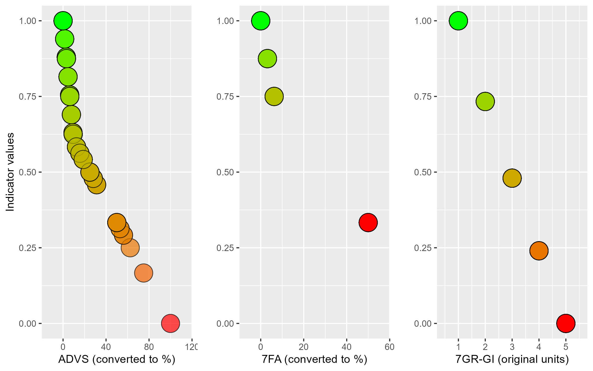
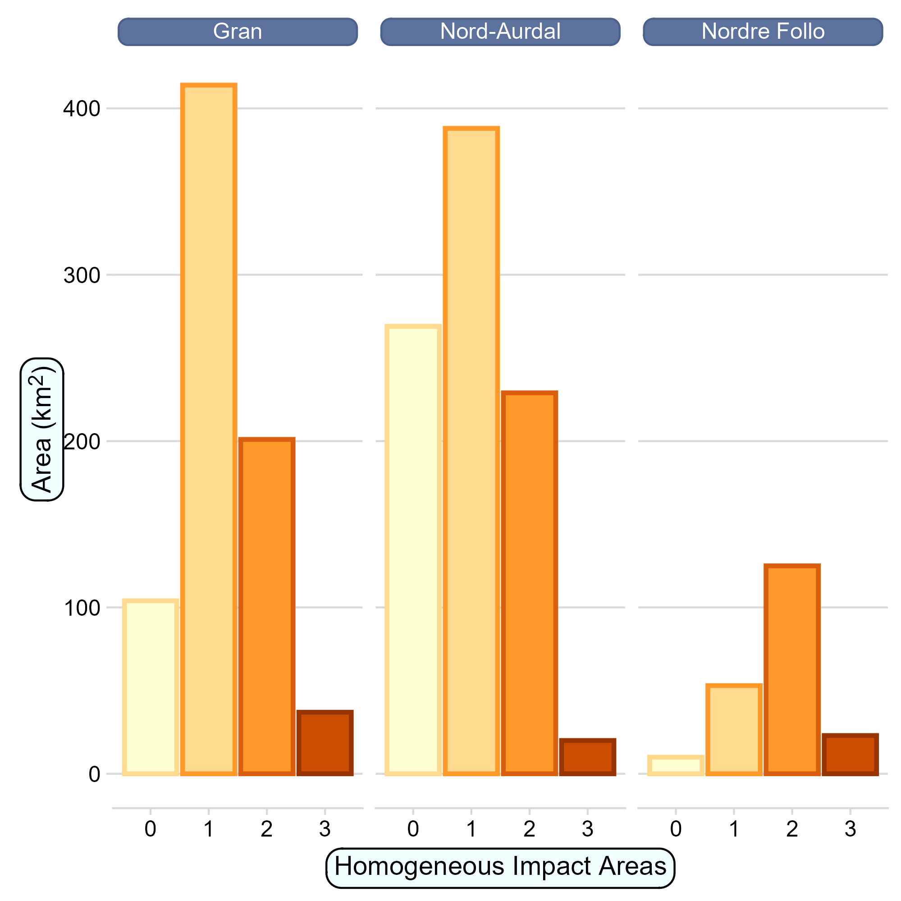

### Extended methods
#### Indicator development

Variable 1, 7FA, represents the abundance of alien species, mainly plants. Variables 2-5 (7SE, PRSL, 7TK and PRTK) describe very related aspects, and are attributed to the same ecosystem condition characteristic (vegetation intactness) and so they were combined into a single indicator called anthropogenic disturbance to soil and vegetation (ADSV; @fig-workflow). The variables are originally recorded along binned frequency ranges [@norwegian_environmental_agency_protocol]. Because the data was strongly right skewed, we used the lower limit for each frequency range to convert them into percentages. This was done by summing the four variables after they had been converted to percentages. This was not a perfect solution, especially since some localities only had one of the variables recorded, but we chose this, rather than for example using a worst rule principle, to better separate the localities in terms of their indicator values. 

Variable 6, 7GR-GI, is different from the preceding variables in that it includes an estimation of future effects that the observed trenches are projected to have on mire vegetation, function, or structure over time. This is not a favourable trait in a metric used to evaluate the ecosystem condition as it is today, yet we include it here nonetheless because there is a general shortage of data on mire hydrology, which is a fundamental part of mire integrity.

The variable 7FA was normalised into the indicator named Alien species; 7GR-GI was normalised into the indicator Trenching; and ADSV was normalised and kept the name ADSV (@fig-workflow). For Alien species and ADSV, X~0~ and X~100~ was defined as 100% and 0%, respectively, whereas X~60~ was defined as 10%, thus making a piece-wise linear transformation (@fig-scaling). For Trenching we defined X~0~ and X~100~ as 1 and 5, respectively, and X~60~ as 2.5 (@fig-scaling). A variable value of 1 indicates an intact mire, and a value of 5 indicates a mire transitioning away from a wetland. A value of 2 indicates observable change within the range expected for the same mapping unit, and a value of 3 indicates a mire transitioning into a neighboring (ecologically speaking) mapping unit. See @fig-workflow for a schematic workflow of the indicator development. Alien species was attributed to Ecosystem Condition Typology (ECT) class B1 - Compositional state characteristics and ADSV, and Trenching were attributed to ECT class A1 - Physical state characteristics [@czucz_common_2021].

```{r fig-workflow}
#| eval: true
#| include: true
#| out.width: '90%'
#| fig.cap:
#| - "Schematic workflow followed in this paper. ADSV = Anthropogenic Disturbance to Soil and Vegetation."

knitr::include_graphics("../images/workflow.jpg")
```

```{r fig-scaling}
#| eval: true
#| include: true
#| out.width: '70%'
#| fig.cap:
#| - "Custom re-scaling of variables to indicators. Unique threshold values are 
#| assignes to each variable and this value is normalised to become 0.6 on the 
#| indicator scale (y-axis). The variables also differ in the number of possible 
#| values they can take, hence the varying number of points for the three panes."


```

```{r fig-muniPosition}
#| fig.cap: "Position of the three example municipalities in Norway."
#| out.width: '50%'

knitr::include_graphics("../images/positionMap.jpg")
```

```{r fig-muniHIAs}
#| fig.cap: "Barplot showing the total area from each homogeneous impact area 
#| in three Norwegian municipalities"
#| out.width: '50%'


```


| HIA class | Lower limit | Upper limit |
|-----------|-------------|-------------|
| 0         | 0           | \<1         |
| 1         | 1           | \<6         |
| 2         | 6           | \<12        |
| 3         | 12          | 15.44       |
: Data ranges used to categorise the Norwegian Land Use Intensity Index (the Infrastructure Index) [@erikstad2023] in the new categorical variable Homogeneous Impact Areas (HIA). {#tbl-ranges}



```{r tbl-EEA}
#| tbl-cap: "Indicator values for three ecosystem condition indicators in three 
#| Norwegian municipalities. Values are medians with 2.5 and 97.5 percentiles
#| for the distribution of possible values."

(tbl <- readRDS("../output/EEA-tbl.RDS"))

```


# References {.unnumbered}

::: {#refs}
:::
